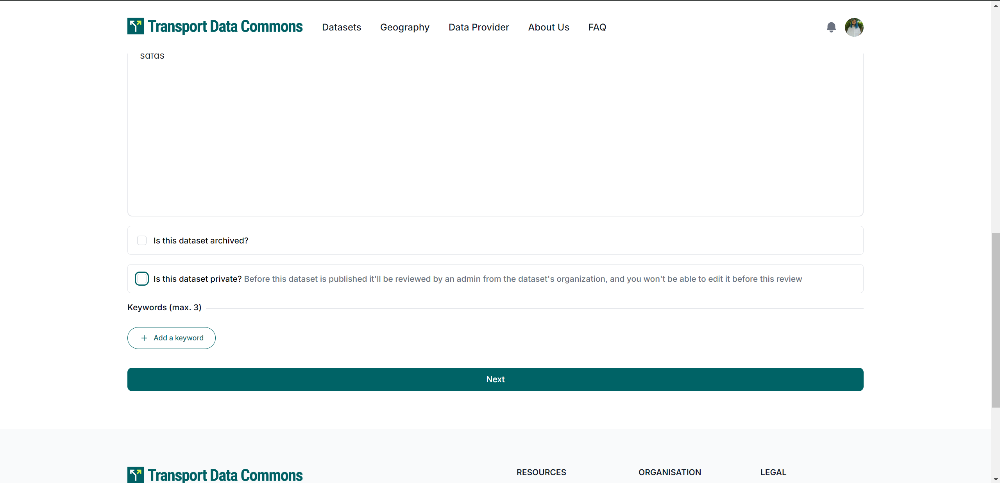
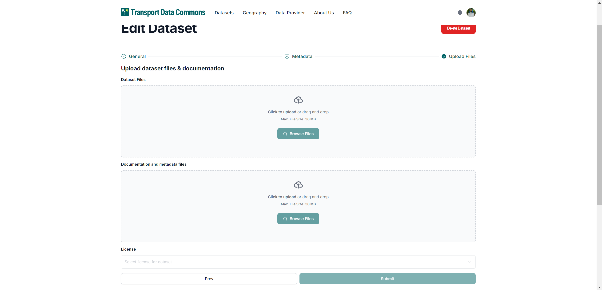
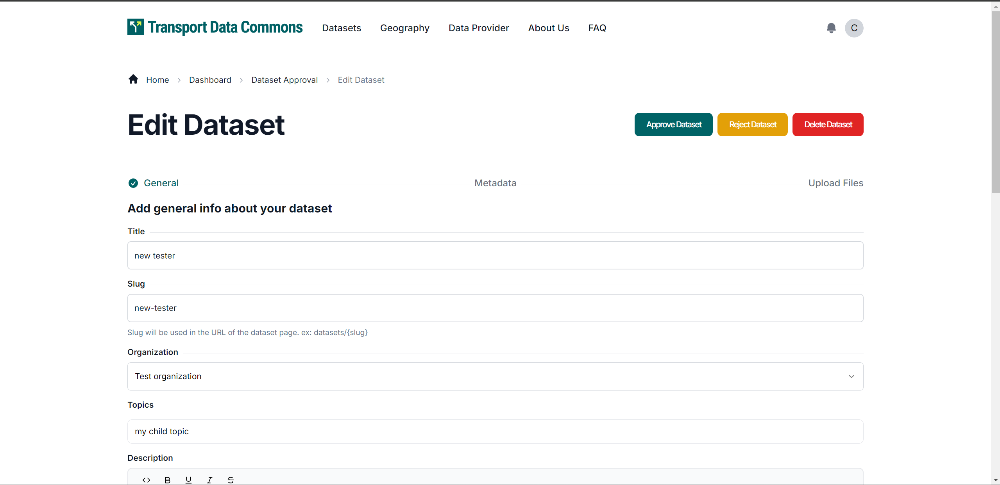
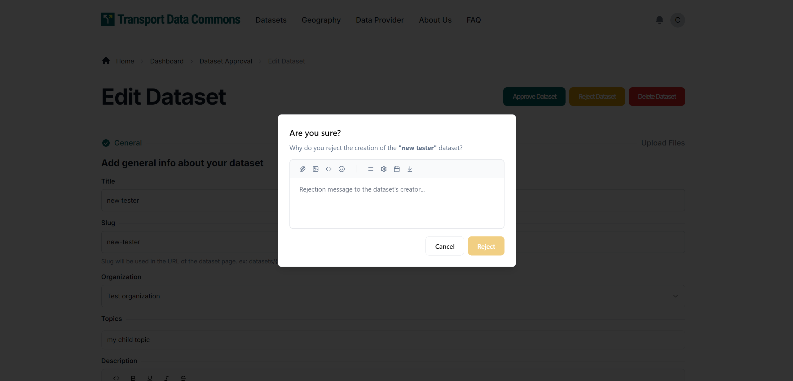
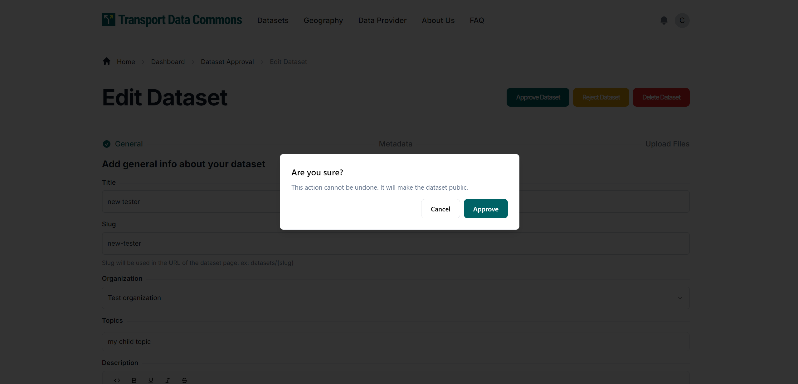
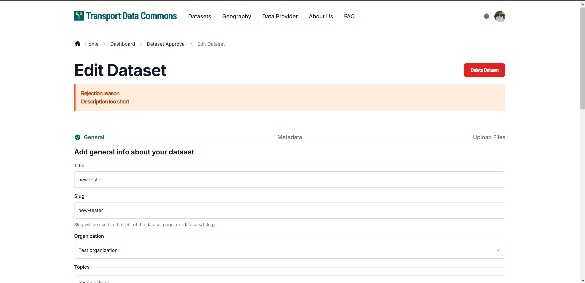

# Approval Workflow

## How it works?

1) When creating a dataset, users can choose whether to make it private or public.

2) If the user chooses to make the dataset private, the approval workflow isn't triggered, and the user can continue working on the dataset any other time or just keep it internal.

3) If the user chooses to make the dataset public, the approval workflow will be triggered, meaning that the dataset will automatically be moved to `private` and its approval status will be `pending`.



4) When approval status is pending, the user can no longer update the dataset metadata (but sysadmins and organization admins can).



5) In this case, either a sysadmin or an organization admin have to reject or approve the dataset before it can be updated by the user again.



6) If the admin decides to reprove the dataset, a feedback has to be provided to the user, so that he can figure out what exactly has to be updated so that the dataset can be approved next time, and the user can immediately update it.



7) If the admin decides to approve the dataset, it will become "public", and the user may start a new approval workflow if the dataset has to be updated again in the future.



8) If a dataset has been rejected and the user no longer wants to publish it, he can simply update the dataset to be private.



## Approval workflow API endpoint

`POST /api/3/action/dataset_approval_update`

This endpoint allows admins to update the approval status of a dataset, either approving or rejecting it.

*_NOTE:_* the `Authorization` header must contain an admin's API token.

**Approval dataset request body example:**

```json
{
  "id": "user-created-dataset",
  "status": "approved"
}
```

**Reject dataset request body example:**

```json
{
  "id": "user-created-dataset",
  "status": "rejected",
  "feedback": "The description is not following the quality standards"
}
```


