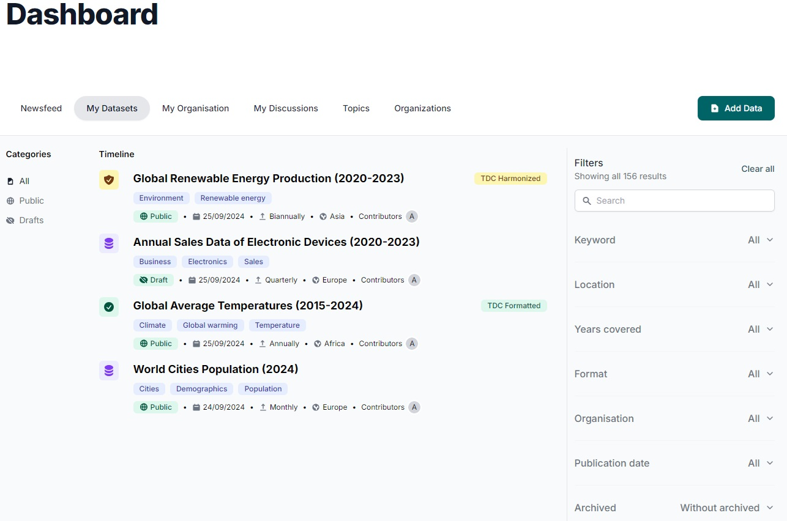

# MY DATASETS

This feature enables data publishers to manage their datasets efficiently through the CKAN API, with a user-friendly interface powered by PortalJS.

## Listing All Datasets

Once signed in, data publishers can view all datasets they’ve created by navigating to the **Datasets** tab in the Dashboard.

### Filtering by State

The API automatically filters datasets by the signed-in user's ID, ensuring only their datasets are displayed. These include:

- **Public Datasets**: Visible to everyone.
- **Private Datasets**: Restricted from public access. Visible for organization members.
- **Draft Datasets**: Datasets that are not yet published.

Users can filter datasets by state using the visibility filters in the left panel.

### Advanced Filters

For more detailed search options, users can apply additional filters located in the right panel. These filters allow a more specific search, enabling users to combine multiple criteria to find datasets quickly.

### Viewing and Editing a Dataset

Clicking on a dataset title redirects the user to the Dataset Details page, where options to **Edit** or **Delete** the dataset are available.

## Adding New Datasets

By clicking the **Add Data** button, the user is redirected to the dataset creation page, where they can easily add more datasets following a straightforward workflow.
