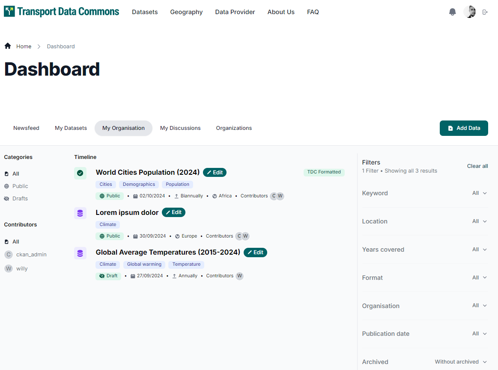

# My Organizations

This page allows users to list and filter datasets from the organizations they belong to.

## Filtering by Status and Contributors

On the left side of the screen, users can filter datasets by status:

- **Public Datasets**: Visible to everyone.
- **Private Datasets**: Restricted from public access. Visible for organization members.
- **Draft Datasets**: Not yet published.

Users can also filter by contributors, showing only datasets created or edited by the selected contributor.

### Advanced Filters

For more detailed searches, additional filters are available on the right panel. These allow users to refine searches by combining multiple criteria like dataset name, title, regions, countries (geographies), resource formats, publication dates, organizations, keywords (tags), and whether the dataset is archived. Results can be sorted by relevance, last modified date, or name, in either ascending or descending order.

### Viewing and Editing a Dataset

Clicking a dataset title takes the user to the Dataset Details page, where they can **Edit** or **Delete** the dataset.

## Adding New Datasets

By clicking the **Add Data** button, users are taken to the dataset creation page to add new datasets through a simple workflow.
