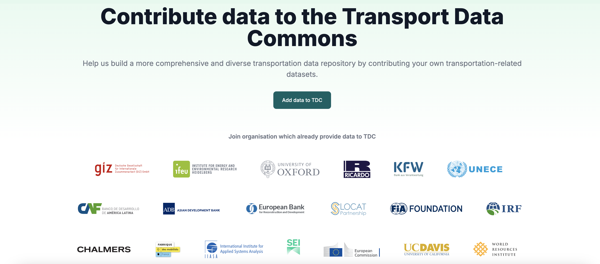
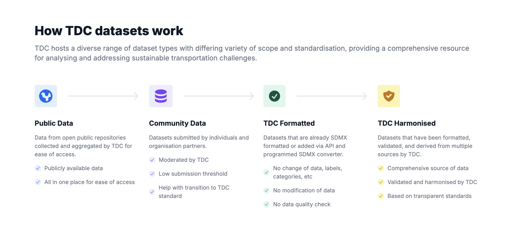
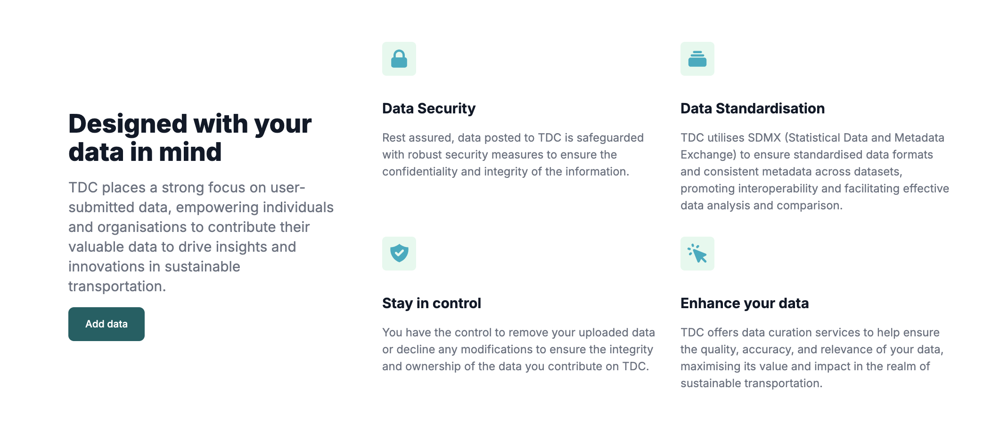
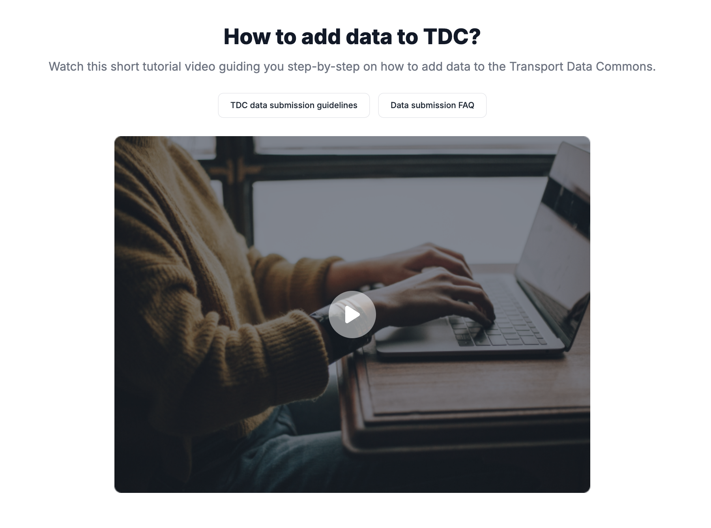

# Data Provider Page

This page consists of the following sections and features:

### Hero

This section allows user to contribute to TDC by redirecting to the `dashboard/datasets/create` page. And listing the Organizations that have already provider data to TDC.



### How TDC datasets work

This section provides an overview of different types of datasets in TDC.



### Add Data Section



### How To Add Data



#### Featured Asset

Allows the configuration of the element that appears on this section, which can be an **image**, an **mp4 video**, or a **YouTube embedded video**.
**How to configure**: In the `public` folder of the frontend project, the following properties should be set in the `tdc-config.json` file to define the type and file path to be displayed:

```
{
  "hero": {
    "path": "/path/to/file",
    "type": "image" | "mp4" | "youtube"
  }
}
```

### FAQ's

This section presents the last 5 frequently asked questions. Click [here](../static-pages/faq) for more detailed documentation on the FAQ section.
