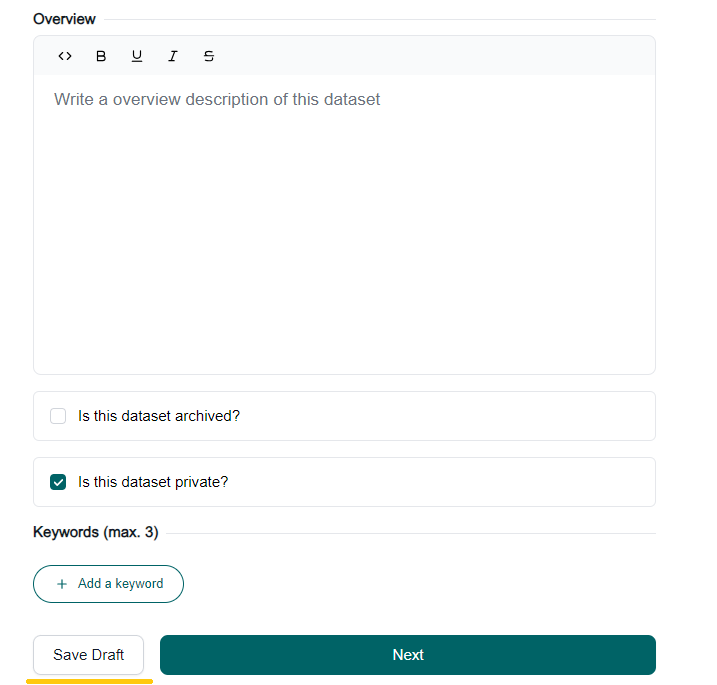

<!-- START doctoc generated TOC please keep comment here to allow auto update -->
<!-- DON'T EDIT THIS SECTION, INSTEAD RE-RUN doctoc TO UPDATE -->
**Table of Contents**  *generated with [DocToc](https://github.com/thlorenz/doctoc)*

- [Saving Datasets as Draft](#saving-datasets-as-draft)
      - [Required Fields for Creating a Draft:](#required-fields-for-creating-a-draft)

<!-- END doctoc generated TOC please keep comment here to allow auto update -->

# Saving Datasets as Draft

When creating a dataset, users can save it as a draft to continue editing later. The dataset will remain in draft mode until all mandatory fields are completed and the user chooses to publish it.

Saving a dataset as a draft updates the dataset's **state** field to "draft."

#### Required Fields for Creating a Draft:

- **name**: The title or identifier of the dataset.
- **owner_org**: The organization that owns or manages the dataset.
- **notes**: A description or additional information about the dataset.
- **tdc_category**: This field categorizes the dataset. If not provided, it will default to "public" when saved as draft
