<!-- START doctoc generated TOC please keep comment here to allow auto update -->
<!-- DON'T EDIT THIS SECTION, INSTEAD RE-RUN doctoc TO UPDATE -->
**Table of Contents**  *generated with [DocToc](https://github.com/thlorenz/doctoc)*

- [Datasets](#datasets)
  - [Create Dataset](#create-dataset)
  - [Edit Dataset](#edit-dataset)
  - [List and Search of Datasets](#list-and-search-of-datasets)

<!-- END doctoc generated TOC please keep comment here to allow auto update -->

# Datasets

## Create Dataset

You can create a dataset in the `/dashboard/datasets/create` route or by clicking in `Add Data` in the dashboard 

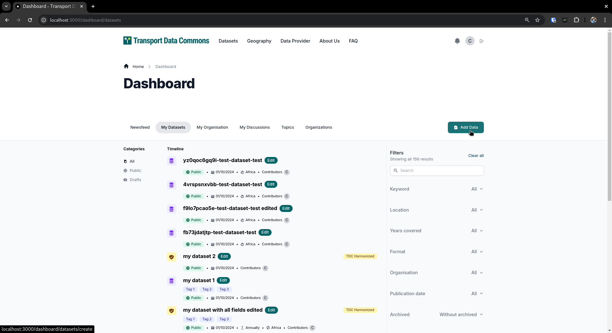

Here you can add all the fields specified in the matadata schema, such as

- Title for the dataset
- URL for the dataset, which is going to act as an ID for the dataset, and act as URL in the public pages such `/datasets/{dataset url}`
- Description for the dataset
- You can also upload the resources and documentation for the datasets in the last step
- And many others

The page looks like this

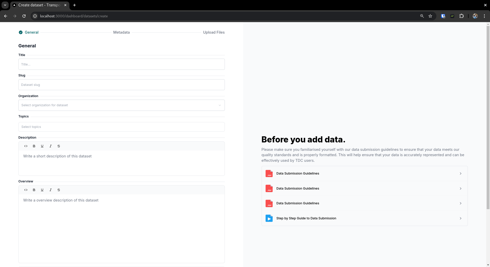

## Edit Dataset

You can edit a dataset by going to `/dashboard/datasets/{dataset url}/edit` or by clicking in the little `Edit` button next to the dataset title in the dashboard list

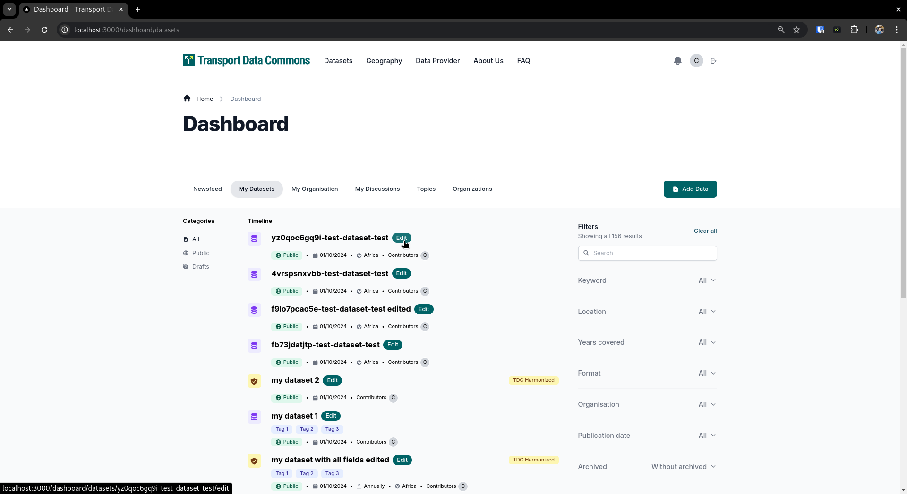

The page should look like this, the form is essentially the same as in the create section, with a slightly different styling around + with the values already filled out

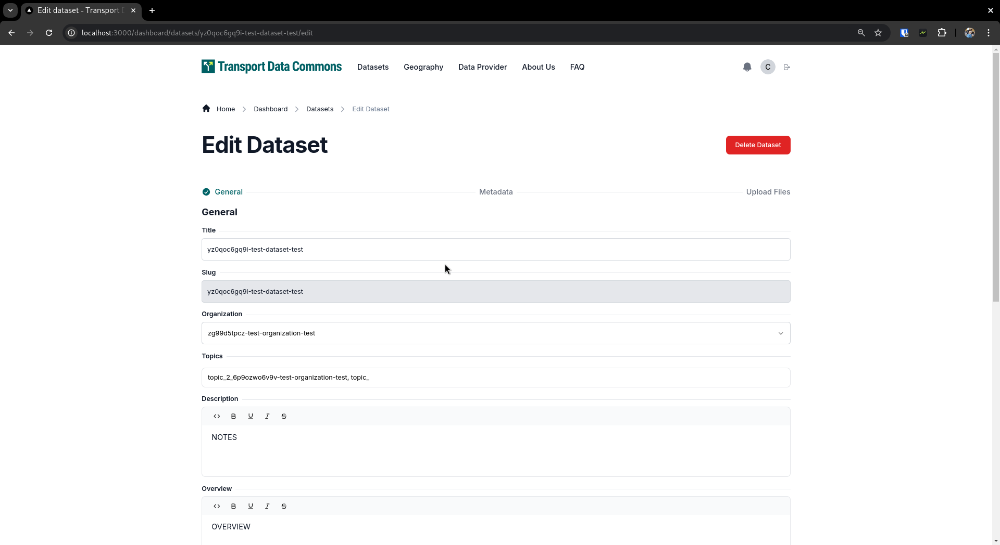

In this edit page, you can also delete the dataset by clicking on the "Delete Button" which should open up a modal for confirmation

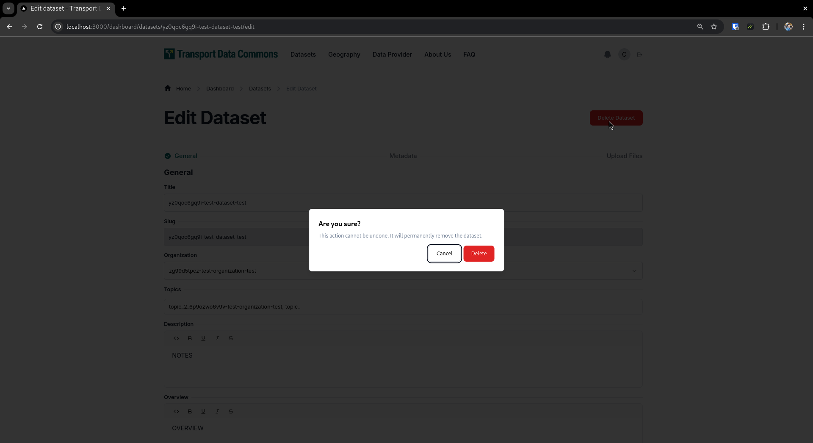

## List and Search of Datasets

To view the Datasets list, you can go to `/search`.

The search function allows you to search for datasets using multiple criteria, including the dataset name, title, regions, countries (geographies), resource formats, publication dates, organizations, keywords (tags), and whether the dataset is archived. The results can be sorted by relevance, last modified date, and name, either descending or ascending.

## Datasets Page

Once you create a dataset, there will be a public page at `/@{dataset org}/{dataset name}` where you will be able to see

An `Overview` section, which is available for datasets with the `Introduction and key takeways field`, which is only available for TDC Harmonized datasets

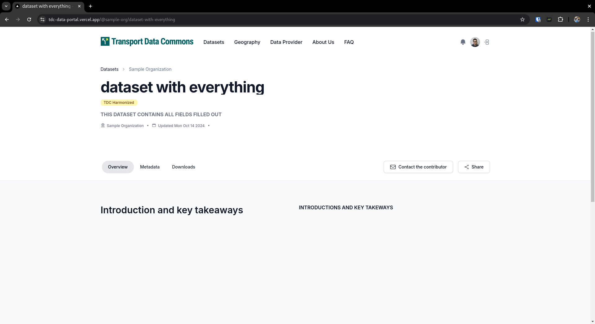

A preview of the dataset, if it has resources that have been pushed to the datasets

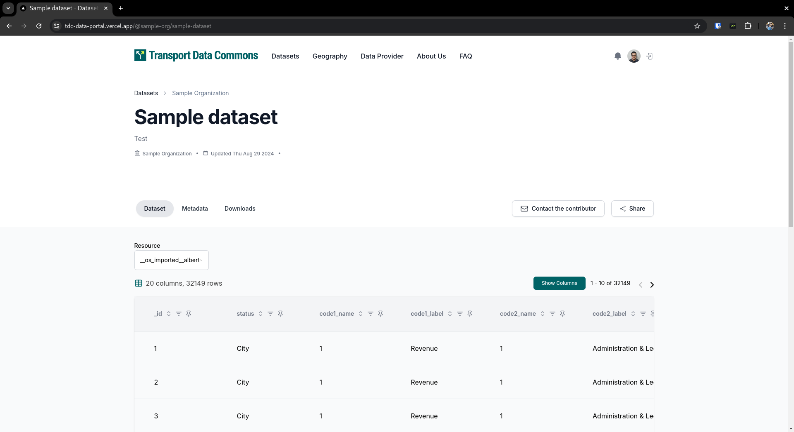

A list of metadata fields and citation examples for the dataset

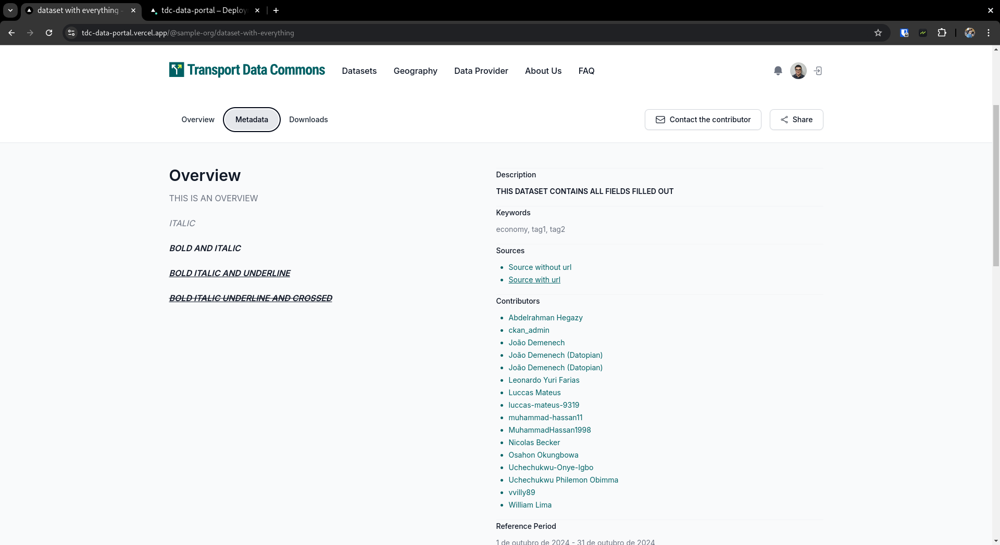

And finally a place where you can download the resources and get an overview of the number of downloads

Obs: The number of downloads data comes from google analytics, and usually is about 24 hours behind the actual values

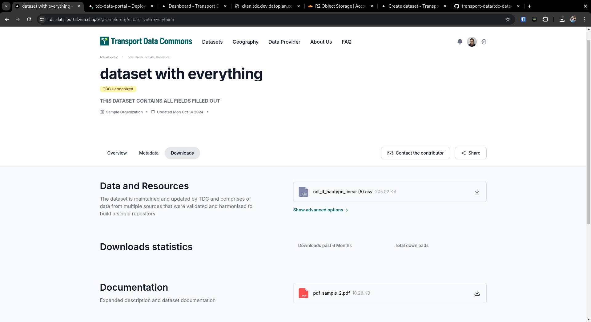

## TDC Harmonized Preview

TDC Harmonized view will have a slightly different table preview, which will be more similar to a pivot table in Excel

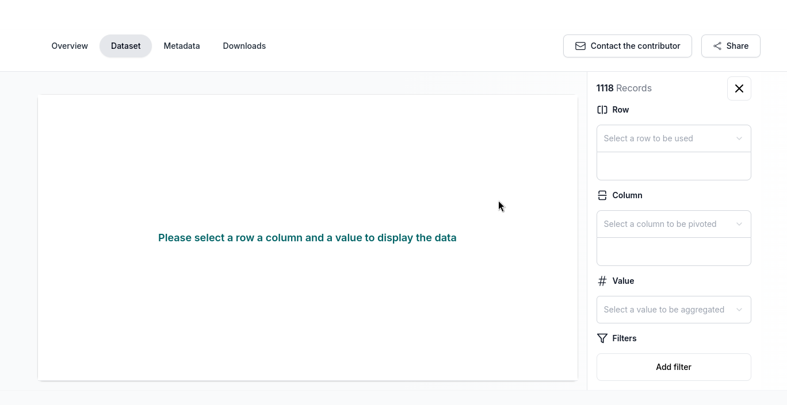

For the data to appear you need to select the row, where we will use all possible values as the rows for the table

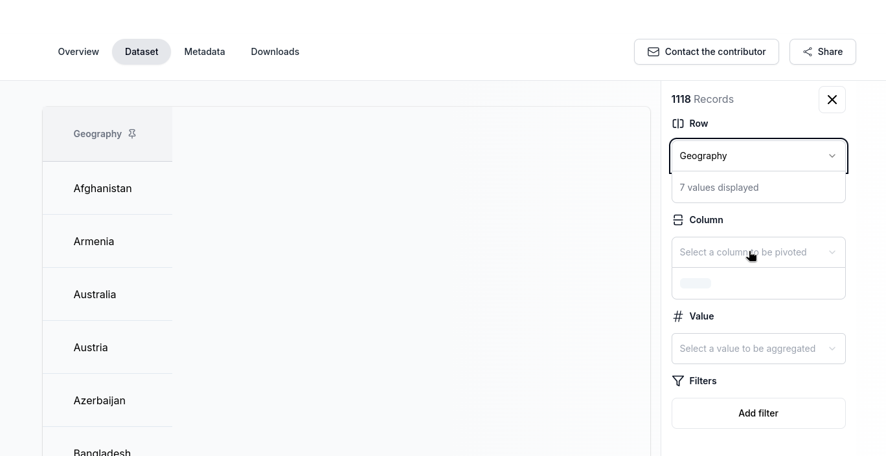

The column, where we will use all possible values as the columns for the table

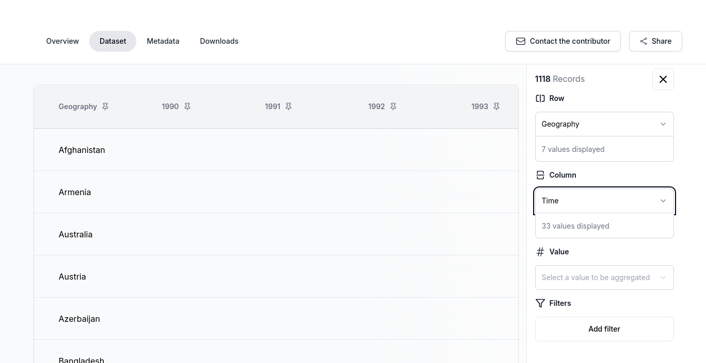

The value, which will be aggregated at the intersection between the column and the row

Optionally you can filter the raw data to get different results, in the example below we are filtering out all rows which have `Diesel` as the value in the `Fuel` column

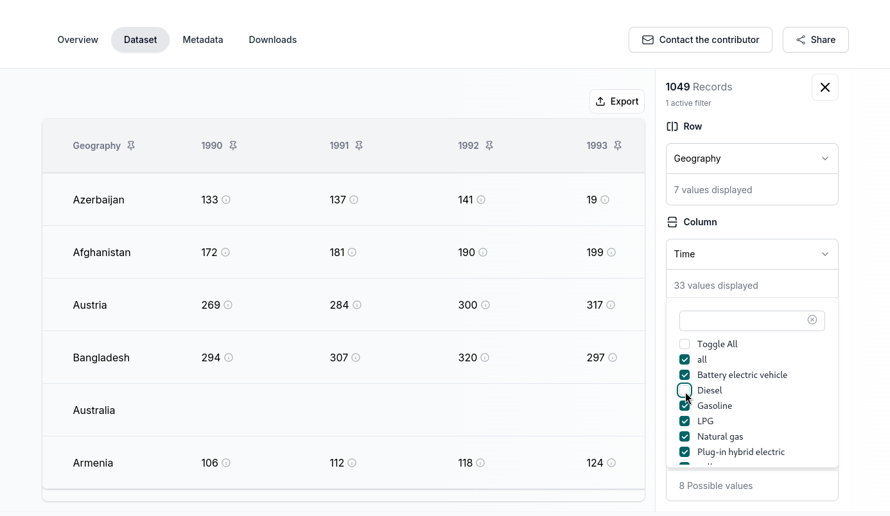

Finally assuming that the table contains the `Metadata` column, if you click on the information circle icon, you will get the value of that columns showing up

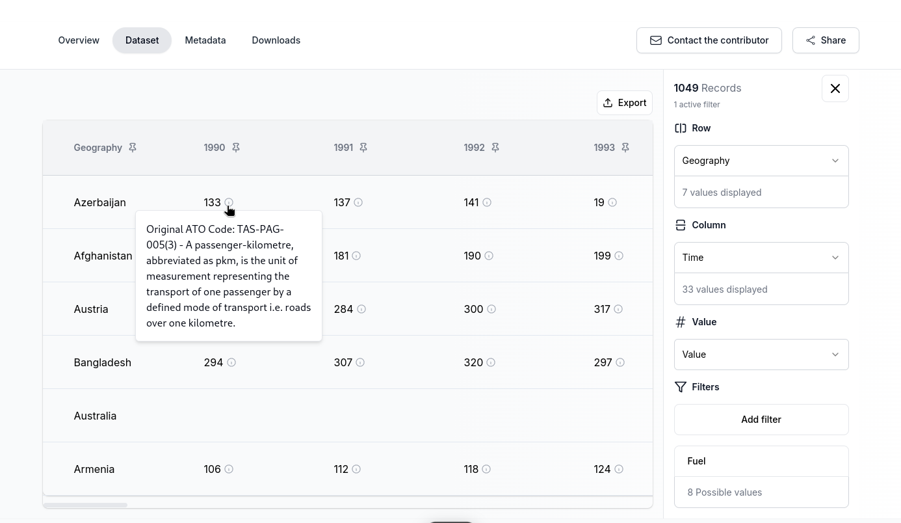
