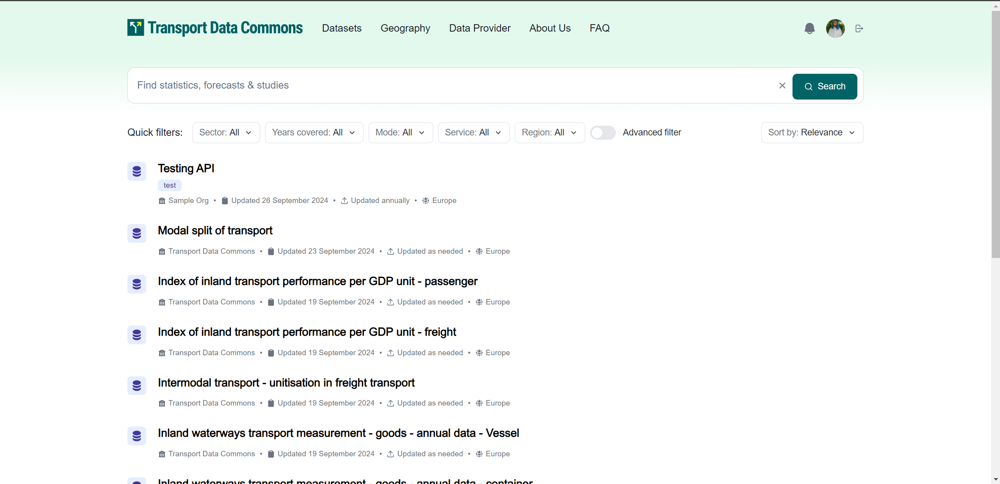

## List and Search of Datasets

To view the Datasets list, you can go to `/search`.

The search function allows you to search for datasets using multiple criteria, including the dataset name, title, regions, countries (geographies), resource formats, publication dates, organizations, keywords (tags), and whether the dataset is archived. The results can be sorted by relevance, last modified date, and name, either descending or ascending.

