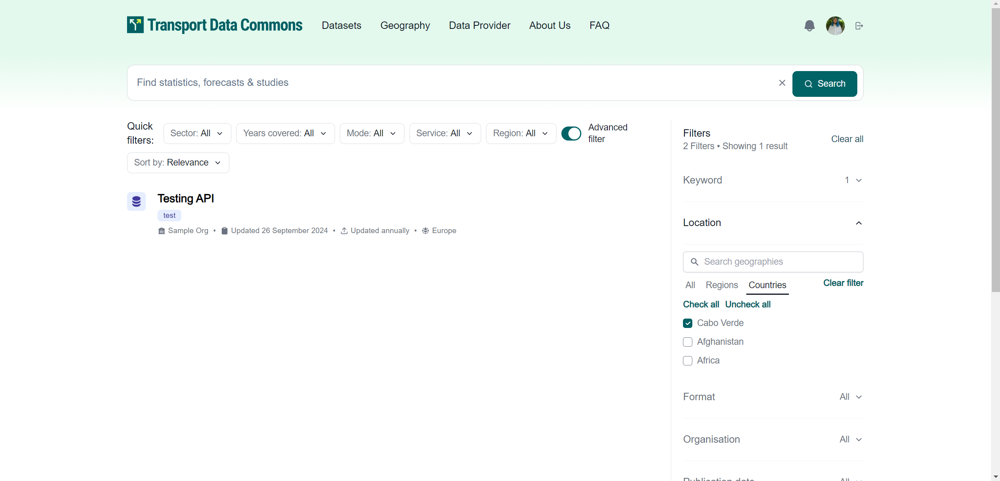

<!-- START doctoc generated TOC please keep comment here to allow auto update -->
<!-- DON'T EDIT THIS SECTION, INSTEAD RE-RUN doctoc TO UPDATE -->
**Table of Contents**  *generated with [DocToc](https://github.com/thlorenz/doctoc)*

- [Datasets](#datasets)
  - [Create Dataset](#create-dataset)
  - [Edit Dataset](#edit-dataset)
  - [List and Search of Datasets](#list-and-search-of-datasets)

<!-- END doctoc generated TOC please keep comment here to allow auto update -->

# Datasets

## Create Dataset

You can create a dataset in the `/dashboard/datasets/create` route or by clicking in `Add Data` in the dashboard 

Here you can add all the fields specified in the matadata schema, such as

- Title for the dataset
- URL for the dataset, which is going to act as an ID for the dataset, and act as URL in the public pages such `/datasets/{dataset url}`
- Description for the dataset
- You can also upload the resources and documentation for the datasets in the last step
- And many others

The page looks like this

## Edit Dataset

You can edit a dataset by going to `/dashboard/datasets/{dataset url}/edit` or by clicking in the little `Edit` button next to the dataset title in the dashboard list

The page should look like this, the form is essentially the same as in the create section, with a slightly different styling around + with the values already filled out

In this edit page, you can also delete the dataset by clicking on the "Delete Button" which should open up a modal for confirmation

## List and Search of Datasets

To view the Datasets list, you can go to `/search`.

The search function allows you to search for datasets using multiple criteria, including the dataset name, title, regions, countries (geographies), resource formats, publication dates, organizations, keywords (tags), and whether the dataset is archived. The results can be sorted by relevance, last modified date, and name, either descending or ascending.

