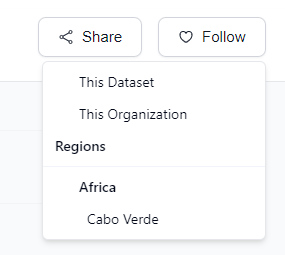

<!-- START doctoc generated TOC please keep comment here to allow auto update -->
<!-- DON'T EDIT THIS SECTION, INSTEAD RE-RUN doctoc TO UPDATE -->
**Table of Contents**  *generated with [DocToc](https://github.com/thlorenz/doctoc)*

- [Follow/Unfollow Datasets, Organizations, and Regions](#followunfollow-datasets-organizations-and-regions)

<!-- END doctoc generated TOC please keep comment here to allow auto update -->

# Follow/Unfollow Datasets, Organizations, and Regions

This feature enables signed-in users to follow or unfollow datasets, organizations, and regions seamlessly.

To use this feature, users must be signed in. After visiting a dataset page, they will find a **"Follow"** button. Clicking this button reveals a dropdown menu, allowing users to select their preferred options to follow.

**Options available:**

- **This dataset**: Follow or unfollow the currently displayed dataset.
- **This organization**: Follow or unfollow the organization associated with the dataset.
- **Regions**: Follow or unfollow the region(s) related to the dataset.
  Following a parent region will disable the selection of child regions, as users will automatically receive notifications from all regions belonging to the selected parent region.
