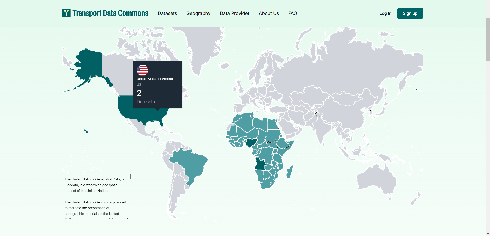
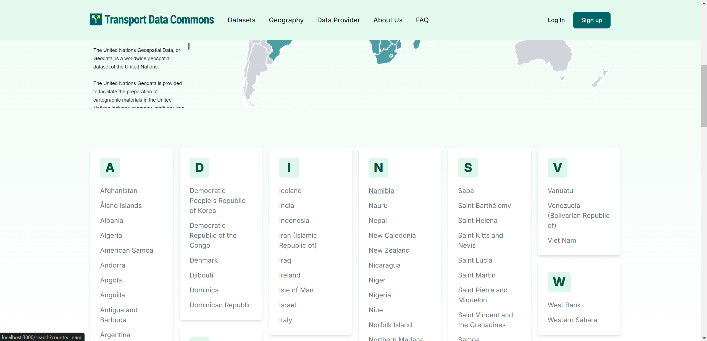

<!-- START doctoc generated TOC please keep comment here to allow auto update -->
<!-- DON'T EDIT THIS SECTION, INSTEAD RE-RUN doctoc TO UPDATE -->
**Table of Contents**  *generated with [DocToc](https://github.com/thlorenz/doctoc)*

- [Geography page](#geography-page)
- [Geographies](#geographies)
  - [Commands](#commands)
    - [Seed default geographies](#seed-default-geographies)
    - [Delete default geographies](#delete-default-geographies)
    - [List default geographies](#list-default-geographies)
  - [List of default geographies](#list-of-default-geographies)

<!-- END doctoc generated TOC please keep comment here to allow auto update -->

# Geography page

The Geography page presents a map that is colored based on the number of datasets in each country. A darker green color indicates the country with the highest number of datasets. 

When the cursor is placed over a country, the number of datasets related to that country is displayed. To initiate a search for datasets related to a specific country, simply click on the country in question. This will redirect you to the search page, where the country will already be filtered.



At the bottom of the map, you will find a list of countries that you can click to be redirected to the datasets search page, where the filters will already be set to the country you clicked.



# Geographies

Geographies are custom CKAN groups that can be either `regions` or `countries`. You can learn more about the `geography` entity at [the metadata schema docs](../metadata-schema#entities).

The default countries and regions for this instance are based on the United Nations geoscheme.

## Commands

### Seed default geographies

In order to seed an instance with the default countries and regions, run the following CLI command:

```bash
ckan -c ckan.ini create-default-geographies

```

### Delete default geographies

```bash
ckan -c ckan.ini delete-default-geographies

```

### List default geographies

```bash
ckan -c ckan.ini list-default-geographies

```

## List of default geographies

The following geographies are created by default when `create-default-geographies` is run:

| Code  | Title                                                | Type           | M49 code | Region        |      |
| ----- | ---------------------------------------------------- | -------------- | -------- | ------------- | ---- |
| ame_s | South America                                        | region         | 5        |               |      |
| ame_n | North America                                        | region         | 3        |               |      |
| abw   | Aruba                                                | country        | 533      | ame_n         | AW   |
| aia   | Anguilla                                             | country        | 660      | ame_n         | AI   |
| arg   | Argentina                                            | country        | 032      | ame_s         | AR   |
| atg   | Antigua and Barbuda                                  | country        | 028      | ame_n         | AG   |
| bhs   | Bahamas                                              | country        | 044      | ame_n         | BS   |
| blz   | Belize                                               | country        | 084      | ame_n         | BZ   |
| bmu   | Bermuda                                              | country        | 060      | ame_n         | BM   |
| bol   | Bolivia (Plurinational State of)                     | country        | 068      | ame_s         | BO   |
| maf   | Saint Martin                                         | country        | 663      | ame_n         | MF   |
| bra   | Brazil                                               | country        | 076      | ame_s         | BR   |
| brb   | Barbados                                             | country        | 052      | ame_n         | BB   |
| can   | Canada                                               | country        | 124      | ame_n         | CA   |
| chl   | Chile                                                | country        | 152      | ame_s         | CL   |
| col   | Colombia                                             | country        | 170      | ame_s         | CO   |
| cri   | Costa Rica                                           | country        | 188      | ame_n         | CR   |
| cub   | Cuba                                                 | country        | 192      | ame_n         | CU   |
| cuw   | Curaçao                                              | country        | 531      | ame_n         | CW   |
| cym   | Cayman Islands                                       | country        | 136      | ame_n         | KY   |
| dma   | Dominica                                             | country        | 212      | ame_n         | DM   |
| dom   | Dominican Republic                                   | country        | 214      | ame_n         | DO   |
| flk   | Falkland Islands (Malvinas)                          | country        | 238      | ame_s         | FK   |
| guf   | French Guiana                                        | country        | 254      | ame_s         | GF   |
| glp   | Guadeloupe                                           | country        | 312      | ame_n         | GP   |
| grd   | Grenada                                              | country        | 308      | ame_n         | GD   |
| grl   | Greenland                                            | country        | 304      | ame_n         | GL   |
| gtm   | Guatemala                                            | country        | 320      | ame_n         | GT   |
| guy   | Guyana                                               | country        | 328      | ame_s         | GY   |
| hnd   | Honduras                                             | country        | 340      | ame_n         | HN   |
| hti   | Haiti                                                | country        | 332      | ame_n         | HT   |
| jam   | Jamaica                                              | country        | 388      | ame_n         | JM   |
| kna   | Saint Kitts and Nevis                                | country        | 659      | ame_n         | KN   |
| lca   | Saint Lucia                                          | country        | 662      | ame_n         | LC   |
| mex   | Mexico                                               | country        | 484      | ame_n         | MX   |
| blm   | Saint Barthélemy                                     | country        | 652      | ame_n         | BL   |
| msr   | Montserrat                                           | country        | 500      | ame_n         | MS   |
| mtq   | Martinique                                           | country        | 474      | ame_n         | MQ   |
| nic   | Nicaragua                                            | country        | 558      | ame_n         | NI   |
| pan   | Panama                                               | country        | 591      | ame_n         | PA   |
| per   | Peru                                                 | country        | 604      | ame_s         | PE   |
| pri   | Puerto Rico                                          | country        | 630      | ame_n         | PR   |
| pry   | Paraguay                                             | country        | 600      | ame_s         | PY   |
| sgs   | South Georgia and the South Sandwich Islands         | country        | 239      | ame_s         | GS   |
| slv   | El Salvador                                          | country        | 222      | ame_n         | SV   |
| spm   | Saint Pierre and Miquelon                            | country        | 666      | ame_n         | PM   |
| sur   | Suriname                                             | country        | 740      | ame_s         | SR   |
| sxm   | Sint Maarten                                         | country        | 534      | ame_n         | SX   |
| tca   | Turks and Caicos Islands                             | country        | 796      | ame_n         | TC   |
| tto   | Trinidad and Tobago                                  | country        | 780      | ame_n         | TT   |
| ury   | Uruguay                                              | country        | 858      | ame_s         | UY   |
| vct   | Saint Vincent and the Grenadines                     | country        | 670      | ame_n         | VC   |
| ven   | Venezuela (Bolivarian Republic of)                   | country        | 862      | ame_s         | VE   |
| vgb   | British Virgin Islands                               | country        | 092      | ame_n         | VG   |
| vir   | United States Virgin Islands                         | country        | 850      | ame_n         | VI   |
| bes   | Saba                                                 | country        | 667      | ame_n         | BQ   |
| ecu   | Ecuador                                              | country        | 218      | ame_s         | EC   |
| usa   | United States of America                             | country        | 840      | ame_n         | US   |
| asi   | Asia                                                 | region         | 142      |               |      |
| afg   | Afghanistan                                          | country        | 004      | asi           | AF   |
| are   | United Arab Emirates                                 | country        | 784      | asi           | AE   |
| arm   | Armenia                                              | country        | 051      | asi           | AM   |
| aze   | Azerbaijan                                           | country        | 031      | asi           | AZ   |
| bgd   | Bangladesh                                           | country        | 050      | asi           | BD   |
| bhr   | Bahrain                                              | country        | 048      | asi           | BH   |
| brn   | Brunei Darussalam                                    | country        | 096      | asi           | BN   |
| btn   | Bhutan                                               | country        | 064      | asi           | BT   |
| chn   | China                                                | country        | 156      | asi           | CN   |
| cyp   | Cyprus                                               | country        | 196      | asi           | CY   |
| geo   | Georgia                                              | country        | 268      | asi           | GE   |
| hkg   | Hong Kong                                            | country        | 344      | asi           | HK   |
| idn   | Indonesia                                            | country        | 360      | asi           | ID   |
| irq   | Iraq                                                 | country        | 368      | asi           | IQ   |
| ind   | India                                                | country        | 356      | asi           | IN   |
| irn   | Iran (Islamic Republic of)                           | country        | 364      | asi           | IR   |
| isr   | Israel                                               | country        | 376      | asi           | IL   |
| jor   | Jordan                                               | country        | 400      | asi           | JO   |
| jpn   | Japan                                                | country        | 392      | asi           | JP   |
| kaz   | Kazakhstan                                           | country        | 398      | asi           | KZ   |
| kgz   | Kyrgyzstan                                           | country        | 417      | asi           | KG   |
| khm   | Cambodia                                             | country        | 116      | asi           | KH   |
| kwt   | Kuwait                                               | country        | 414      | asi           | KW   |
| kor   | Republic of Korea                                    | country        | 410      | asi           | KR   |
| lao   | Lao People's Democratic Republic                     | country        | 418      | asi           | LA   |
| lbn   | Lebanon                                              | country        | 422      | asi           | LB   |
| lka   | Sri Lanka                                            | country        | 144      | asi           | LK   |
| mac   | Macao                                                | country        | 446      | asi           | MO   |
| mdv   | Maldives                                             | country        | 462      | asi           | MV   |
| mmr   | Myanmar                                              | country        | 104      | asi           | MM   |
| mng   | Mongolia                                             | country        | 496      | asi           | MN   |
| mys   | Malaysia                                             | country        | 458      | asi           | MY   |
| npl   | Nepal                                                | country        | 524      | asi           | NP   |
| omn   | Oman                                                 | country        | 512      | asi           | OM   |
| pak   | Pakistan                                             | country        | 586      | asi           | PK   |
| phl   | Philippines                                          | country        | 608      | asi           | PH   |
| sau   | Saudi Arabia                                         | country        | 682      | asi           | SA   |
| prk   | Democratic People's Republic of Korea                | country        | 408      | asi           | KP   |
| qat   | Qatar                                                | country        | 634      | asi           | QA   |
| sgp   | Singapore                                            | country        | 702      | asi           | SG   |
| twn   | Taiwan                                               | country        | 158      | asi           | TW   |
| syr   | Syrian Arab Republic                                 | country        | 760      | asi           | SY   |
| tha   | Thailand                                             | country        | 764      | asi           | TH   |
| tjk   | Tajikistan                                           | country        | 762      | asi           | TJ   |
| tkm   | Turkmenistan                                         | country        | 795      | asi           | TM   |
| tls   | Timor-Leste                                          | country        | 626      | asi           | TL   |
| tur   | Türkiye                                              | country        | 792      | asi           | TR   |
| uzb   | Uzbekistan                                           | country        | 860      | asi           | UZ   |
| vnm   | Viet Nam                                             | country        | 704      | asi           | VN   |
| xjk   | Jammu and Kashmir                                    | country        |          | asi           | xk   |
| yem   | Yemen                                                | country        | 887      | asi           | YE   |
| pse   | West Bank                                            | country        | 402      | asi           | PS   |
| afr   | Africa                                               | region         | 2        |               |      |
| ago   | Angola                                               | country        | 024      | afr           | AO   |
| bdi   | Burundi                                              | country        | 108      | afr           | BI   |
| atf   | French Southern Territories                          | country        | 260      | afr           | TF   |
| ben   | Benin                                                | country        | 204      | afr           | BJ   |
| bfa   | Burkina Faso                                         | country        | 854      | afr           | BF   |
| bwa   | Botswana                                             | country        | 072      | afr           | BW   |
| caf   | Central African Republic                             | country        | 140      | afr           | CF   |
| civ   | Côte d'Ivoire                                        | country        | 384      | afr           | CI   |
| cmr   | Cameroon                                             | country        | 120      | afr           | CM   |
| com   | Comoros                                              | country        | 174      | afr           | KM   |
| cod   | Democratic Republic of the Congo                     | country        | 180      | afr           | CD   |
| cog   | Congo                                                | country        | 178      | afr           | CG   |
| cpv   | Cabo Verde                                           | country        | 132      | afr           | CV   |
| dji   | Djibouti                                             | country        | 262      | afr           | DJ   |
| dza   | Algeria                                              | country        | 012      | afr           | DZ   |
| egy   | Egypt                                                | country        | 818      | afr           | EG   |
| eri   | Eritrea                                              | country        | 232      | afr           | ER   |
| esh   | Western Sahara                                       | country        | 732      | afr           | EH   |
| eth   | Ethiopia                                             | country        | 231      | afr           | ET   |
| gab   | Gabon                                                | country        | 266      | afr           | GA   |
| gha   | Ghana                                                | country        | 288      | afr           | GH   |
| gin   | Guinea                                               | country        | 324      | afr           | GN   |
| gmb   | Gambia                                               | country        | 270      | afr           | GM   |
| gnb   | Guinea-Bissau                                        | country        | 624      | afr           | GW   |
| gnq   | Equatorial Guinea                                    | country        | 226      | afr           | GQ   |
| ken   | Kenya                                                | country        | 404      | afr           | KE   |
| mar   | Morocco                                              | country        | 504      | afr           | MA   |
| lbr   | Liberia                                              | country        | 430      | afr           | LR   |
| lby   | Libya                                                | country        | 434      | afr           | LY   |
| lso   | Lesotho                                              | country        | 426      | afr           | LS   |
| mdg   | Madagascar                                           | country        | 450      | afr           | MG   |
| mli   | Mali                                                 | country        | 466      | afr           | ML   |
| moz   | Mozambique                                           | country        | 508      | afr           | MZ   |
| bvt   | Bouvet Island                                        | country        | 74       | afr           | BV   |
| mrt   | Mauritania                                           | country        | 478      | afr           | MR   |
| mwi   | Malawi                                               | country        | 454      | afr           | MW   |
| myt   | Mayotte                                              | country        | 175      | afr           | YT   |
| nam   | Namibia                                              | country        | 516      | afr           | NA   |
| ner   | Niger                                                | country        | 562      | afr           | NE   |
| nga   | Nigeria                                              | country        | 566      | afr           | NG   |
| reu   | Réunion                                              | country        | 638      | afr           | RE   |
| rwa   | Rwanda                                               | country        | 646      | afr           | RW   |
| sdn   | Sudan                                                | country        | 729      | afr           | SD   |
| sen   | Senegal                                              | country        | 686      | afr           | SN   |
| sle   | Sierra Leone                                         | country        | 694      | afr           | SL   |
| som   | Somalia                                              | country        | 706      | afr           | SO   |
| ssd   | South Sudan                                          | country        | 728      | afr           | SS   |
| stp   | Sao Tome and Principe                                | country        | 678      | afr           | ST   |
| swz   | Eswatini                                             | country        | 748      | afr           | SZ   |
| syc   | Seychelles                                           | country        | 690      | afr           | SC   |
| tcd   | Chad                                                 | country        | 148      | afr           | TD   |
| tgo   | Togo                                                 | country        | 768      | afr           | TG   |
| tun   | Tunisia                                              | country        | 788      | afr           | TN   |
| tza   | United Republic of Tanzania                          | country        | 834      | afr           | TZ   |
| uga   | Uganda                                               | country        | 800      | afr           | UG   |
| zaf   | South Africa                                         | country        | 710      | afr           | ZA   |
| zmb   | Zambia                                               | country        | 894      | afr           | ZM   |
| zwe   | Zimbabwe                                             | country        | 716      | afr           | ZW   |
| mus   | Mauritius                                            | country        | 480      | afr           | MU   |
| shn   | Saint Helena                                         | country        | 654      | afr           | SH   |
| eur   | Europe                                               | region         | 150      |               |      |
| ala   | Åland Islands                                        | country        | 248      | eur           | AX   |
| alb   | Albania                                              | country        | 008      | eur           | AL   |
| and   | Andorra                                              | country        | 020      | eur           | AD   |
| aut   | Austria                                              | country        | 040      | eur           | AT   |
| bel   | Belgium                                              | country        | 056      | eur           | BE   |
| cze   | Czechia                                              | country        | 203      | eur           | CZ   |
| bgr   | Bulgaria                                             | country        | 100      | eur           | BG   |
| bih   | Bosnia and Herzegovina                               | country        | 070      | eur           | BA   |
| blr   | Belarus                                              | country        | 112      | eur           | BY   |
| che   | Switzerland                                          | country        | 756      | eur           | CH   |
| mda   | Republic of Moldova                                  | country        | 498      | eur           | MD   |
| deu   | Germany                                              | country        | 276      | eur           | DE   |
| dnk   | Denmark                                              | country        | 208      | eur           | DK   |
| est   | Estonia                                              | country        | 233      | eur           | EE   |
| fin   | Finland                                              | country        | 246      | eur           | FI   |
| fro   | Faroe Islands                                        | country        | 234      | eur           | FO   |
| fra   | France                                               | country        | 250      | eur           | FR   |
| gbr   | United Kingdom of Great Britain and Northern Ireland | country        | 826      | eur           | GB   |
| gib   | Gibraltar                                            | country        | 292      | eur           | GI   |
| grc   | Greece                                               | country        | 300      | eur           | GR   |
| hrv   | Croatia                                              | country        | 191      | eur           | HR   |
| hun   | Hungary                                              | country        | 348      | eur           | HU   |
| isl   | Iceland                                              | country        | 352      | eur           | IS   |
| irl   | Ireland                                              | country        | 372      | eur           | IE   |
| ita   | Italy                                                | country        | 380      | eur           | IT   |
| mco   | Monaco                                               | country        | 492      | eur           | MC   |
| lie   | Liechtenstein                                        | country        | 438      | eur           | LI   |
| ltu   | Lithuania                                            | country        | 440      | eur           | LT   |
| lux   | Luxembourg                                           | country        | 442      | eur           | LU   |
| lva   | Latvia                                               | country        | 428      | eur           | LV   |
| mkd   | North Macedonia                                      | country        | 807      | eur           | MK   |
| mlt   | Malta                                                | country        | 470      | eur           | MT   |
| mne   | Montenegro                                           | country        | 499      | eur           | ME   |
| ggy   | Guernsey                                             | country        | 831      | eur           | GG   |
| imn   | Isle of Man                                          | country        | 833      | eur           | IM   |
| jey   | Jersey                                               | country        | 832      | eur           | JE   |
| nld   | Kingdom of the Netherlands                           | country        | 528      | eur           | NL   |
| rus   | Russian Federation                                   | country        | 643      | eur           | RU   |
| nor   | Norway                                               | country        | 578      | eur           | NO   |
| rou   | Romania                                              | country        | 642      | eur           | RO   |
| pol   | Poland                                               | country        | 616      | eur           | PL   |
| sjm   | Svalbard and Jan Mayen Islands                       | country        | 744      | eur           | SJ   |
| smr   | San Marino                                           | country        | 674      | eur           | SM   |
| srb   | Serbia                                               | country        | 688      | eur           | RS   |
| svk   | Slovakia                                             | country        | 703      | eur           | SK   |
| svn   | Slovenia                                             | country        | 705      | eur           | SI   |
| swe   | Sweden                                               | country        | 752      | eur           | SE   |
| ukr   | Ukraine                                              | country        | 804      | eur           | UA   |
| vat   | Holy See                                             | country        | 336      | eur           | VA   |
| esp   | Spain                                                | country        | 724      | eur           | ES   |
| prt   | Portugal                                             | country        | 620      | eur           | PT   |
| oce   | Australia and Oceania                                | region         | 9        |               |      |
| asm   | American Samoa                                       | country        | 016      | oce           | AS   |
| aus   | Australia                                            | country        | 036      | oce           | AU   |
| cck   | Cocos (Keeling) Islands                              | country        | 166      | oce           | CC   |
| cok   | Cook Islands                                         | country        | 184      | oce           | CK   |
| cxr   | Christmas Island                                     | country        | 162      | oce           | CX   |
| fji   | Fiji                                                 | country        | 242      | oce           | FJ   |
| gum   | Guam                                                 | country        | 316      | oce           | GU   |
| fsm   | Micronesia (Federated States of)                     | country        | 583      | oce           | FM   |
| hmd   | Heard Island and McDonald Islands                    | country        | 334      | oce           | HM   |
| kir   | Kiribati                                             | country        | 296      | oce           | KI   |
| mhl   | Marshall Islands                                     | country        | 584      | oce           | MH   |
| mnp   | Northern Mariana Islands                             | country        | 580      | oce           | MP   |
| wsm   | Samoa                                                | country        | 882      | oce           | WS   |
| ncl   | New Caledonia                                        | country        | 540      | oce           | NC   |
| niu   | Niue                                                 | country        | 570      | oce           | NU   |
| nzl   | New Zealand                                          | country        | 554      | oce           | NZ   |
| nru   | Nauru                                                | country        | 520      | oce           | NR   |
| pcn   | Pitcairn                                             | country        | 612      | oce           | PN   |
| plw   | Palau                                                | country        | 585      | oce           | PW   |
| png   | Papua New Guinea                                     | country        | 598      | oce           | PG   |
| pyf   | French Polynesia                                     | country        | 258      | oce           | PF   |
| slb   | Solomon Islands                                      | country        | 090      | oce           | SB   |
| tuv   | Tuvalu                                               | country        | 798      | oce           | TV   |
| tkl   | Tokelau                                              | country        | 772      | oce           | TK   |
| ton   | Tonga                                                | country        | 776      | oce           | TO   |
| vut   | Vanuatu                                              | country        | 548      | oce           | VU   |
| nfk   | Norfolk Island                                       | country        | 574      | oce           | NF   |
