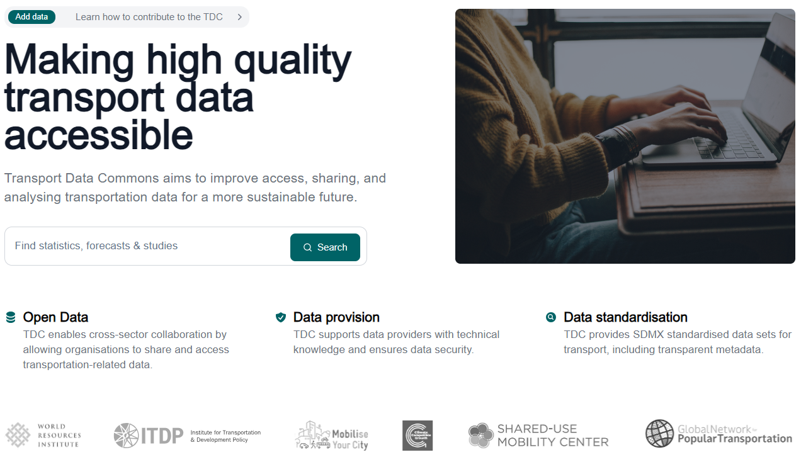

# Home Page

The portal's home page consists of the following sections and features:

### Hero

Introduction section to the portal that includes the following features:


#### Dataset Search

Click [here](../search-bar-component) for more detailed documentation on the search bar.

#### Featured Asset

Allows the configuration of the element that appears to the right of the Hero, which can be an **image**, an **mp4 video**, or a **YouTube embedded video**.
**How to configure**: In the `public` folder of the frontend project, the following properties should be set in the `tdc-config.json` file to define the type and file path to be displayed:

```
{
  "hero": {
    "path": "/path/to/file",
    "type": "image" | "mp4" | "youtube"
  }
}
```

### Recently Added Datasets

This section shows the last 6 datasets added, sorted by `metadata_modified desc` .

### Testimonials Section

Click [here](../static-pages/testimonials) for more detailed documentation on the testimonials section.

### FAQ's

This section presents the last 5 frequently asked questions. Click [here](../static-pages/faq) for more detailed documentation on the FAQ section.
