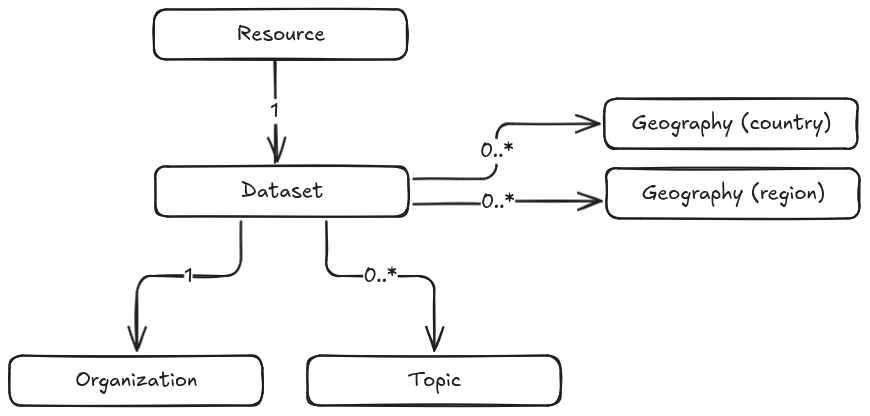

<!-- START doctoc generated TOC please keep comment here to allow auto update -->
<!-- DON'T EDIT THIS SECTION, INSTEAD RE-RUN doctoc TO UPDATE -->
**Table of Contents**  *generated with [DocToc](https://github.com/thlorenz/doctoc)*

- [Metadata Schema](#metadata-schema)
  - [Entities](#entities)
    - [Relationships](#relationships)
    - [Customization](#customization)
    - [Why geographies are configured as a CKAN custom group type](#why-geographies-are-configured-as-a-ckan-custom-group-type)
  - [Schemas](#schemas)
    - [Dataset](#dataset)
      - [Title](#title)
      - [URL](#url)
      - [Description](#description)
      - [Keywords](#keywords)
      - [License](#license)
      - [Organization](#organization)
      - [Reference period](#reference-period)
      - [Geographies](#geographies)
      - [TDC category](#tdc-category)
      - [Sources](#sources)
      - [Topics](#topics)
      - [Overview](#overview)
      - [Language](#language)
      - [Contributors](#contributors)
      - [Is archived](#is-archived)
      - [Sectors](#sectors)
      - [Modes](#modes)
      - [Services](#services)
      - [Update frequency](#update-frequency)
      - [Indicators](#indicators)
      - [Data provider](#data-provider)
      - [URL](#url-1)
      - [Data access](#data-access)
      - [Comments](#comments)
      - [Units](#units)
      - [Dimensioning](#dimensioning)
      - [Related datasets](#related-datasets)
      - [Introduction text](#introduction-text)
    - [Resource](#resource)
      - [URL](#url-2)
      - [Name](#name)
      - [Format](#format)
      - [Type](#type)
    - [Organization](#organization-1)
      - [Title](#title-1)
      - [Name](#name-1)
      - [Description](#description-1)
      - [Email](#email)
      - [Website URL](#website-url)
    - [Topic](#topic)
      - [Title](#title-2)
      - [Name](#name-2)
      - [Description](#description-2)
      - [Image URL](#image-url)
    - [Geography](#geography)
      - [Title](#title-3)
      - [Name](#name-3)
      - [Geography Type](#geography-type)
      - [Parents](#parents)
  - [Prerequisites](#prerequisites)

<!-- END doctoc generated TOC please keep comment here to allow auto update -->

# Metadata Schema

## Entities

The following entities are used in the TDC CKAN extension:

| Name | Title | CKAN type |
| ---- | ----- | --------- |
| dataset | Dataset | [dataset](https://docs.ckan.org/en/2.11/user-guide.html#datasets-and-resources) |
| resource | Resource | [resource](https://docs.ckan.org/en/2.11/user-guide.html#datasets-and-resources) |
| organization | Organization | [organization](https://docs.ckan.org/en/2.11/maintaining/authorization.html#organizations) |
| topic | Topic | default group |
| geography | Geography | custom group with hierarchy |

### Relationships

The way the entities relate to each other is the following:



Note that:

1) A resource must belong to exactly one dataset, and multiple resources may belong to the same given dataset
2) A dataset must belong to exactly one organization
3) A dataset may belong to one or more topics and/or geographies
4) Multiple datasets may belong to the same given organization, topic or geography

### Customization

This taxonomy is mostly what comes built-in into CKAN, except for the following customizations:

- "Group" is renamed to "Topic"
- "Geography" is a custom group type

### Why geographies are configured as a CKAN custom group type

- CKAN has a built-in "follower" system, which enables users to "follow" groups and receive notifications about them. We want to enable users to follow geographies or their interest.
- [ckanext-hierarchy](https://github.com/ckan/ckanext-hierarchy) makes it possible to have parent and children groups. This is handy for regions and countries, which have a parent/children relationship.
- The responses for group-related API endpoints will already include dataset count for regions and countries
- With [ckanext-scheming](https://github.com/datopian/ckanext-scheming), we can create extra metadata fields for geographies

## Schemas 

### Dataset

**JSON schema:** [dataset.yaml](https://github.com/transport-data/tdc-data-portal/tree/main/src/ckanext-tdc/ckanext/tdc/schemas/dataset.yaml)

Example of a request body to create a dataset:

```json
{
  "title": "Testing API",
  "name": "testing-api-63",
  "notes": "testing",
  "tags": [
    {
      "name": "test"
    }
  ],
  "license_id": "CC-SA",
  "owner_org": "this-is-my-new-organization",
  "temporal_coverage_start": "2024-01-01",
  "temporal_coverage_end": "2024-02-01",
  "geographies": [
    "br"
  ],
  "tdc_category": "public",
  "sources": [
    {
      "title": "My source",
      "url": "https://datopian.com"
    }
  ],
  "overview_text": "Testing",
  "language": "en",
  "is_archived": false,
  "sectors": ["aviation"],
  "modes": ["car"],
  "services": ["passenger"],
  "frequency": "annually",
  "indicators": ["indicator 1"],
  "data_provider": "Datopian",
  "url": "https://datopian.com",
  "data_access": "Publicly available",
  "comments": [{
      "initials": "JD",
      "date": "2024-01-01",
      "comment": "This is an internal comment"
  }],
  "introduction_text": "# Hello world"
}
```

#### Title

| API field name | Type | Required | DCAT-AP field | Default value |
| -- | -- | -- | -- | -- |
| title | string | Yes | Yes | N/A |

Title of the dataset as shown to users.

**Example:**

```json
{
    "title": "My title"
}
```

#### URL

| API field name | Type | Required | DCAT-AP field | Default value |
| -- | -- | -- | -- | -- |
| name | string | Yes | No | N/A |

Usually it's the sluggified version of the dataset's title. Used in URLs.

**Example:**

```json
{
    "name": "my-title"
}
```

#### Description

| API field name | Type | Required | DCAT-AP field | Default value |
| -- | -- | -- | -- | -- |
| notes | markdown | Yes | Yes | N/A |

Description of the dataset. It supports markdown formatting.

**Example:**

```json
{
    "notes": "My dataset's description"
}
```

#### Keywords

| API field name | Type | Required | DCAT-AP field | Default value |
| -- | -- | -- | -- | -- |
| tags | {"name": "Tag name"}[] | No | Yes | N/A |

Keywords that help to describe the dataset.

**Example:**

```json
{
    "tags": [{"name": "keyword"}]
}
```

#### License

| API field name | Type | Required | DCAT-AP field | Default value |
| -- | -- | -- | -- | -- |
| license_id | string | No | Yes | N/A |

License attached to the dataset. For options, see https://docs.ckan.org/en/2.11/api/index.html#ckan.logic.action.get.license_list.

**Example:**

```json
{
    "license_id": "CC-SA"
}
```

#### Organization

| API field name | Type | Required | DCAT-AP field | Default value |
| -- | -- | -- | -- | -- |
| owner_org | string | Yes | Yes | N/A |

Organization the dataset belongs to.

**Example:**

```json
{
    "owner_org": "my-organization"
}
```

#### Reference period

| API field name | Type | Required | DCAT-AP field | Default value |
| -- | -- | -- | -- | -- |
| temporal_coverage_start and temporal_coverage_end | No | No | Yes | N/A |

What time window the data in the dataset covers.

**Example:**

```json
{
    "temporal_coverage_start": "2024-01-01",
    "temporal_coverage_end": "2024-02-01"
}
```

#### Geographies

| API field name | Type | Required | DCAT-AP field | Default value |
| -- | -- | -- | -- | -- |
| geographies | string[] | No | Yes | N/A |

List of countries the dataset is associated with. Regions are calculated automatically based on the chosen countries.

[Codes for valid geographies](../geographies)

**Example:**

```json
{
    "geographies": ["bra"]
}
```

#### TDC category

| API field name | Type | Required | DCAT-AP field | Default value |
| -- | -- | -- | -- | -- |
| tdc_category | public OR community OR tdc_formatted OR tdc_harmonized | Yes | No | public |

Defines the current category for this dateset, which can be Public Data, Community Data, TDC Formatted or TDC Harmonized.

**Example:**

```json
{
    "tdc_category": "public"
}
```

#### Sources

| API field name | Type | Required | DCAT-AP field | Default value |
| -- | -- | -- | -- | -- |
| sources | {"title": string, "url ": string}[] | No | Yes | N/A |

Sources for this dataset.

**Example:**

```json
{
    "sources": [{
        "title": "My source",
        "url": "https://datopian.com"
    }]
}
```

#### Topics

| API field name | Type | Required | DCAT-AP field | Default value |
| -- | -- | -- | -- | -- |
| topics | string[] | No | No | N/A |

Topics associated with the dataset.

**Example:**

```json
{
    "topics": ["my-topic"]
}
```

#### Overview

| API field name | Type | Required | DCAT-AP field | Default value |
| -- | -- | -- | -- | -- |
| overview_text | markdown | No | No | N/A |

This is the text that appears on the LHS of the metadata tab on the dataset page. Note that it supports markdown formatting.

**Example:**

```json
{
    "overview_text": "Some notes about my dataset"
}
```

#### Language

| API field name | Type | Required | DCAT-AP field | Default value |
| -- | -- | -- | -- | -- |
| language | string | No | Yes | N/A |

Language (ISO 639-1 code) of the dataset.

**Example:**

```json
{
    "language": "en"
}
```

#### Contributors

| API field name | Type | Required | DCAT-AP field | Default value |
| -- | -- | -- | -- | -- |
| contributors | User[] | No | No | N/A |

This field keeps track of which users got involved with a dataset. **It is autogenerated and cannot be set via API.**

#### Is archived

| API field name | Type | Required | DCAT-AP field | Default value |
| -- | -- | -- | -- | -- |
| is_archived | boolean | No | No | false |

Whether the dataset is archived or not. Defaults to not archived.

**Example:**

```json
{
    "is_archived": true
}
```

#### Sectors

| API field name | Type | Required | DCAT-AP field | Default value |
| -- | -- | -- | -- | -- |
| sectors | string[] | No | No | N/A |

Sectors the dataset is associated with.

**Example:**

```json
{
    "sectors": ["aviation"]
}
```

#### Modes

| API field name | Type | Required | DCAT-AP field | Default value |
| -- | -- | -- | -- | -- |
| modes | string[] | No | No | N/A |

Transport modes the dataset is associated with.

**Example:**

```json
{
    "modes": ["bus"]
}
```

#### Services

| API field name | Type | Required | DCAT-AP field | Default value |
| -- | -- | -- | -- | -- |
| services | string[] | No | No | N/A |

Services the dataset is associated with. It can be "freight", "passenger" or both.

**Example:**

```json
{
    "services": ["passenger"]
}
```

#### Update frequency

| API field name | Type | Required | DCAT-AP field | Default value |
| -- | -- | -- | -- | -- |
| frequency | string | No | No | N/A |

Expected update frequency of this dataset.

**Example:**

```json
{
    "frequency": "annually"
}
```

#### Indicators

| API field name | Type | Required | DCAT-AP field | Default value |
| -- | -- | -- | -- | -- |
| indicators | string[] | No | No | N/A |

Indicators of the dataset.

**Example:**

```json
{
    "indicators": "Air freight"
}
```

#### Data provider

| API field name | Type | Required | DCAT-AP field | Default value |
| -- | -- | -- | -- | -- |
| data_provider | string | No | No | N/A |

Organization or individual that provides the data and any related metadata.

**Example:**

```json
{
    "data_provider": "Datopian"
}
```

#### URL

| API field name | Type | Required | DCAT-AP field | Default value |
| -- | -- | -- | -- | -- |
| url | string | No | No | N/A |

Location on the internet with further information about the dataset.

**Example:**

```json
{
    "url": "https://datopian.com"
}
```

#### Data access

| API field name | Type | Required | DCAT-AP field | Default value |
| -- | -- | -- | -- | -- |
| data_access | string | No | No | N/A |

Any conditions on data access, e.g. publicly available, proprietary, fee or subscription required, available on request, etc.

**Example:**

```json
{
    "data_access": "Publicly available"
}
```

#### Comments

| API field name | Type | Required | DCAT-AP field | Default value |
| -- | -- | -- | -- | -- |
| comments | {"initials": string, "date": string, "comment": string}[] | No | No | N/A |

Any other information about the metadata values, for instance discrepancies or unclear or missing information.

**Example:**

```json
{
    "comments": [{
        "initials": "JD",
        "date": "2024-01-01",
        "comment": "Some fields are missing..."
    }]
}
```

#### Units

| API field name | Type | Required | DCAT-AP field | Default value |
| -- | -- | -- | -- | -- |
| units | string[] | No | No | N/A |

Units used in the dataset.

**Example:**

```json
{
    "units": ["tonnes"]
}
```

#### Dimensioning

| API field name | Type | Required | DCAT-AP field | Default value |
| -- | -- | -- | -- | -- |
| dimensioning | string | No | No | N/A |

Dimensioning used in the dataset.

**Example:**

```json
{
    "dimensioning": "registrations by type"
}
```

#### Related datasets

| API field name | Type | Required | DCAT-AP field | Default value |
| -- | -- | -- | -- | -- |
| related_datasets | string[] | No | No | N/A |

This field is used to support TDC Formatted datasets. The value should be a list of dataset ids.

**Example:**

```json
{
    "related_datasets": ["related-dataset-id"]
}
```

#### Introduction text

| API field name | Type | Required | DCAT-AP field | Default value |
| -- | -- | -- | -- | -- |
| introduction_text | markdown | No | No | N/A |

This text is shown on the dataset page under the Overview tab when the dataset is TDC Harmonized.

**Example:**

```json
{
    "introduction_text": "# Hello world"
}
```

### Resource

**JSON schema:** [dataset.yaml](https://github.com/transport-data/tdc-data-portal/tree/main/src/ckanext-tdc/ckanext/tdc/schemas/dataset.yaml)

Example of a request body to create a resource:

```json
{
  "package_id": "291b4b34-5ba9-446b-a0cd-b72af340db42",
  "url": "https://google.com",
  "name": "file.csv",
  "format": "csv",
  "resource_type": "data"
}`
```

#### URL

| API field name | Type | Required | DCAT-AP field | Default value |
| -- | -- | -- | -- | -- |
| url | string | Yes | No | N/A |

URL of the data file.

**Example:**

```json
{
    "url": "https://storage.com/my-data.csv"
}
```

#### Name

| API field name | Type | Required | DCAT-AP field | Default value |
| -- | -- | -- | -- | -- |
| name | string | Yes | No | N/A |

Name of the resource, as shown to users.

**Example:**

```json
{
    "name": "my-data.csv"
}
```

#### Format

| API field name | Type | Required | DCAT-AP field | Default value |
| -- | -- | -- | -- | -- |
| format | string | Yes | No | N/A |

File format/extension of the resource.

**Example:**

```json
{
    "format": "csv"
}
```

#### Type

| API field name | Type | Required | DCAT-AP field | Default value |
| -- | -- | -- | -- | -- |
| resource_type | data OR documentation | Yes | No | N/A |

Description

**Example:**

```json
{
    "type": "data"
}
```

### Organization

**JSON schema:** [organization.yaml](https://github.com/transport-data/tdc-data-portal/tree/main/src/ckanext-tdc/ckanext/tdc/schemas/organization.yaml)

Example of a request body to create a organization:

```json
{
  "title": "My Organization",
  "name": "my-organization",
  "notes": "Description",
  "email": "contact@datopian.com",
  "url": "https://datopian.com"
}
```

#### Title

| API field name | Type | Required | DCAT-AP field | Default value |
| -- | -- | -- | -- | -- |
| title | string | Yes | Yes | N/A |

Title of the organization, as shown to the users.

**Example:**

```json
{
    "title": "My Organization"
}
```

#### Name

| API field name | Type | Required | DCAT-AP field | Default value |
| -- | -- | -- | -- | -- |
| name | string | Yes | No | N/A |

Usually a sluggified version of the title. Used in URLs.

**Example:**

```json
{
    "name": "my-organization"
}
```

#### Description

| API field name | Type | Required | DCAT-AP field | Default value |
| -- | -- | -- | -- | -- |
| notes | markdown | No | No | N/A |

Description of the organization.

**Example:**

```json
{
    "notes": "My organization is awesome."
}
```

#### Email

| API field name | Type | Required | DCAT-AP field | Default value |
| -- | -- | -- | -- | -- |
| email | string | No | No | N/A |

Email to contact the organization.

**Example:**

```json
{
    "email": "contact@datopian.com"
}
```

#### Website URL

| API field name | Type | Required | DCAT-AP field | Default value |
| -- | -- | -- | -- | -- |
| url | string | No | No | N/A |

URL pointing to the website of the organization.

**Example:**

```json
{
    "url": "https://myorg.com"
}
```

### Topic

**JSON schema:** [topic.yaml](https://github.com/transport-data/tdc-data-portal/tree/main/src/ckanext-tdc/ckanext/tdc/schemas/topic.yaml)

Example of a request body to create a topic:

```json
{
  "title": "My Topic",
  "name": "my-topic",
  "notes": "Description",
  "url": "https://storage.com/topic.png",
  "type": "topic"
}
```

#### Title

| API field name | Type | Required | DCAT-AP field | Default value |
| -- | -- | -- | -- | -- |
| title | string | Yes | Yes | N/A |

Title of the topic, as shown to the users.

**Example:**

```json
{
    "title": "My Topic"
}
```

#### Name

| API field name | Type | Required | DCAT-AP field | Default value |
| -- | -- | -- | -- | -- |
| name | string | Yes | No | N/A |

Usually a sluggified version of the title. Used in URLs.

**Example:**

```json
{
    "name": "my-topic"
}
```

#### Description

| API field name | Type | Required | DCAT-AP field | Default value |
| -- | -- | -- | -- | -- |
| notes | markdown | No | No | N/A |

Description of the topic.

**Example:**

```json
{
    "notes": "My topic is awesome."
}
```

#### Image URL

| API field name | Type | Required | DCAT-AP field | Default value |
| -- | -- | -- | -- | -- |
| url | string | No | No | N/A |

URL pointing to the image file for the topic.

**Example:**

```json
{
    "url": "https://storage.com/image.png"
}
```

### Geography

**JSON schema:** [geography.yaml](https://github.com/transport-data/tdc-data-portal/tree/main/src/ckanext-tdc/ckanext/tdc/schemas/geography.yaml)

Example of a request body to create a geography:

```json
{
  "title": "Brazil",
  "name": "br",
  "geography_type": "country",
  "type": "grography",
  "groups": [{"name": "sa"}]
}
```

#### Title

| API field name | Type | Required | DCAT-AP field | Default value |
| -- | -- | -- | -- | -- |
| title | string | Yes | No | N/A |

Title of the geography, as shown to the users.

**Example:**

```json
{
    "title": "Brazil"
}
```

#### Name

| API field name | Type | Required | DCAT-AP field | Default value |
| -- | -- | -- | -- | -- |
| name | string | Yes | No | N/A |

Code for the geography.

**Example:**

```json
{
    "name": "br"
}
```

#### Geography Type

| API field name | Type | Required | DCAT-AP field | Default value |
| -- | -- | -- | -- | -- |
| geography_type | country OR region | Yes | No | N/A |

Description

**Example:**

```json
{
    "geography_type": "country"
}
```

#### Parents

| API field name | Type | Required | DCAT-AP field | Default value |
| -- | -- | -- | -- | -- |
| groups | {"name": string}[] | No | No | N/A |

When creating countries, users can specify which regions are the parents of the country using this field.

**Example:**

```json
{
    "groups": [{"name": "sa"}]
}
```

## Prerequisites

The following environment variables must be set:

```bash
CKAN___SCHEMING__DATASET_SCHEMAS=ckanext.tdc:schemas/dataset.yaml
CKAN___SCHEMING__GROUP_SCHEMAS="ckanext.tdc:schemas/topic.yaml ckanext.tdc:schemas/geography.yaml"
CKAN___SCHEMING__ORGANIZATION_SCHEMAS="ckanext.tdc:schemas/organization.yaml"
CKAN___SCHEMING__PRESETS="ckanext.tdc:schemas/presets.yaml"
CKAN__DEFAULT__GROUP_TYPE=topic
CKAN__PLUGINS="tdc hierarchy_display scheming_datasets scheming_groups scheming_organizations dcat envvars image_view text_view activity auth s3filestore datastore datapusher resource_proxy"
```
