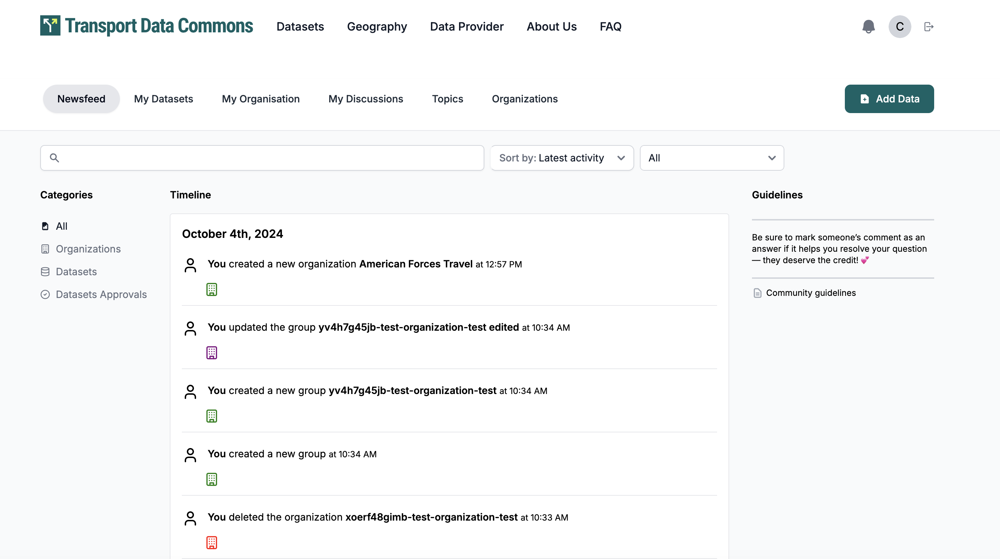
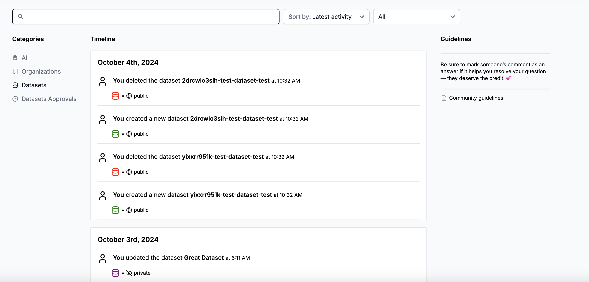
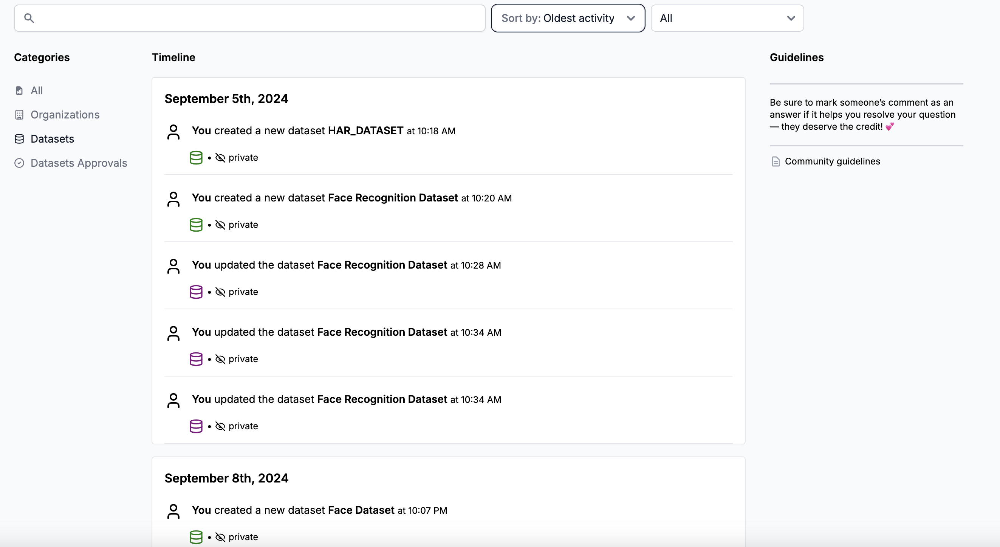

# Newsfeed Page

The newsfeed page shows the activity regarding organizations that an user is a member of a follower and also the datasets that belong to these organizations

User can search by activity type and name.

User can filter activities based on four categories:

- All
- Organizations
- Datasets
- Dataset Approvals

User can sort by latest and oldest activities.

