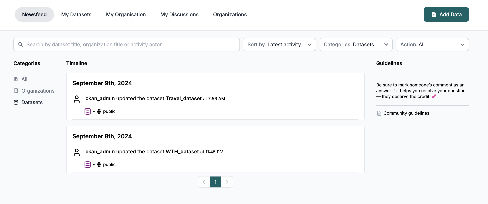
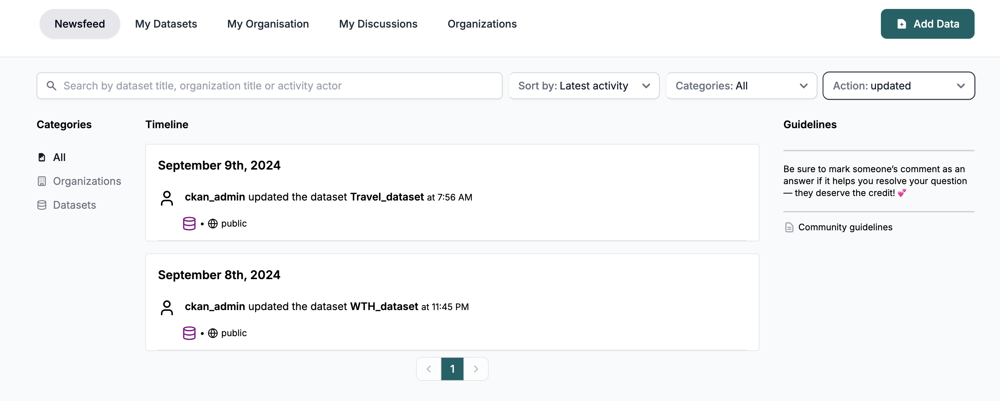

<!-- START doctoc generated TOC please keep comment here to allow auto update -->
<!-- DON'T EDIT THIS SECTION, INSTEAD RE-RUN doctoc TO UPDATE -->
**Table of Contents**  *generated with [DocToc](https://github.com/thlorenz/doctoc)*

- [Newsfeed Page](#newsfeed-page)
  - [Searching](#searching)
  - [Filtering](#filtering)
    - [Filter by category](#filter-by-category)
    - [Filter by action](#filter-by-action)
  - [Sorting](#sorting)

<!-- END doctoc generated TOC please keep comment here to allow auto update -->

# Newsfeed Page

The newsfeed page shows the activities regarding organizations that a user is a member of, or follower and also the datasets that belong to these organizations

## Searching

User can search by dataset name and title, organization name and title, or actor.

## Filtering

following two filters types are available to the user:

### Filter by category

User can filter activities based on three categories:

- All
- Organizations
- Datasets

`Note:` Dataset Approvals category will be included in the future.

### Filter by action

User can filter activities based on four actions:

- All
- created
- deleted
- updated

## Sorting

User can sort by latest or oldest activities.

