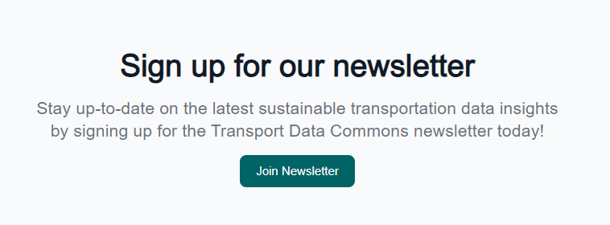

<!-- START doctoc generated TOC please keep comment here to allow auto update -->
<!-- DON'T EDIT THIS SECTION, INSTEAD RE-RUN doctoc TO UPDATE -->
**Table of Contents**  *generated with [DocToc](https://github.com/thlorenz/doctoc)*

- [Newsletter](#newsletter)

<!-- END doctoc generated TOC please keep comment here to allow auto update -->

# Newsletter

This functionality redirects the user to a external page for the newsletter sign up.

