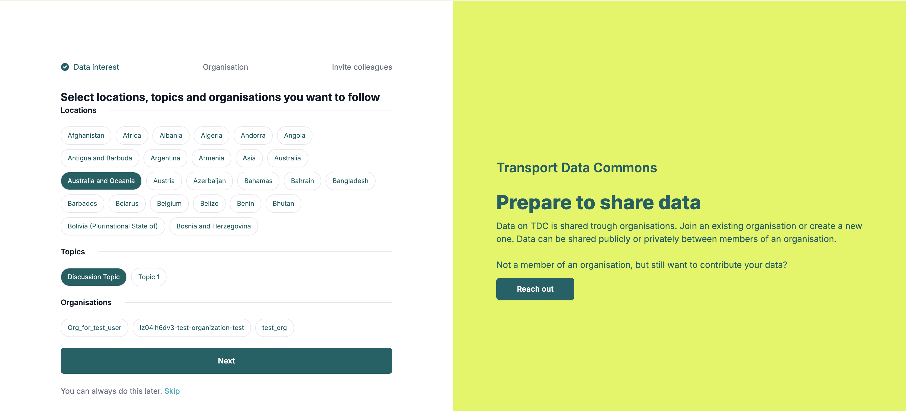
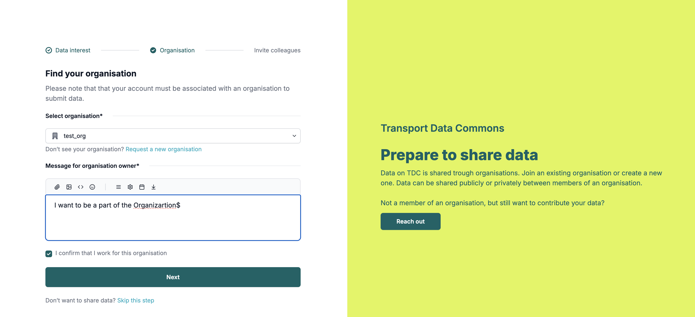
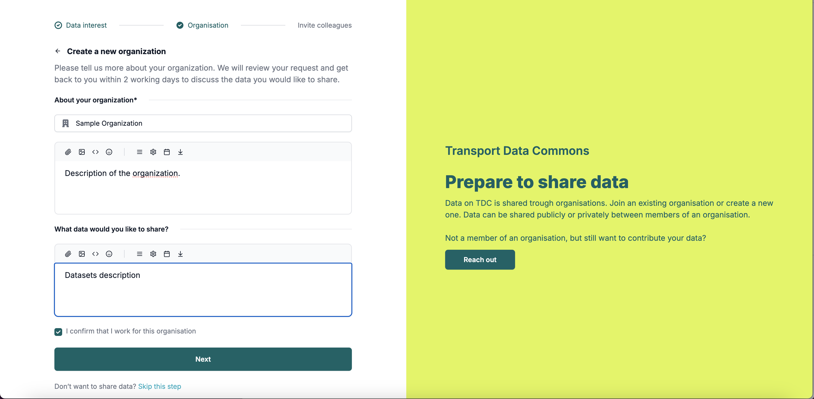
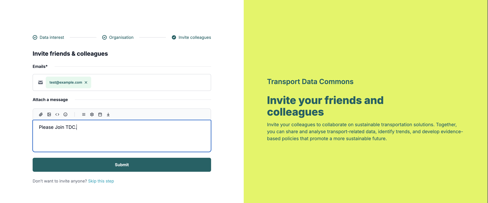

# Onboarding

Once the user signs up at `/auth/signup` route he is redirected to the Onboarding page at `/onboarding`.
During the onboarding process, user can follow locations, topics and organizations, request to be a part of an existing organization or request to create a new one and also invite other users.

## Follow

During the Follow Phase, user can select locations, topics and organizations he wants to follow.

## Organization Participation

During this phase, users can select the organization they want to be a part of. And request the organization owner along with a message. User also need to check the checkbox, confirming he is a part of the organization.
The organization owner will revieve the request on his email.

The `Request a new organization` link will move the user to `New Organization Request Form`.

### New Organization Creation Request

If the user cannot find his organization, he can request the `sysadmin` to create a new organization by clicking on the `Request a new organization` link.

User can add the organization details on the form. Sysadmin will recieve the request on his email.

## Invite Users

During this phase, users can invite other users to TDC by typing their emails and attaching a message. Users will recieve the invites on their emails.

#### Note

The data for any step will be submitted only if the user clicks `Next` (`Submit` in case of User invite step)button on that step. The data will not be submitted if users clicks `skip this step` or simply navigate to the next step using the navigation links at top.