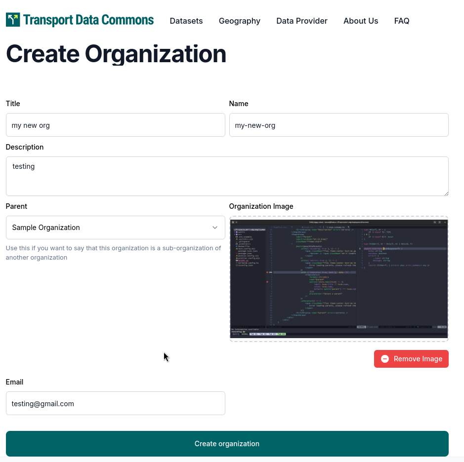
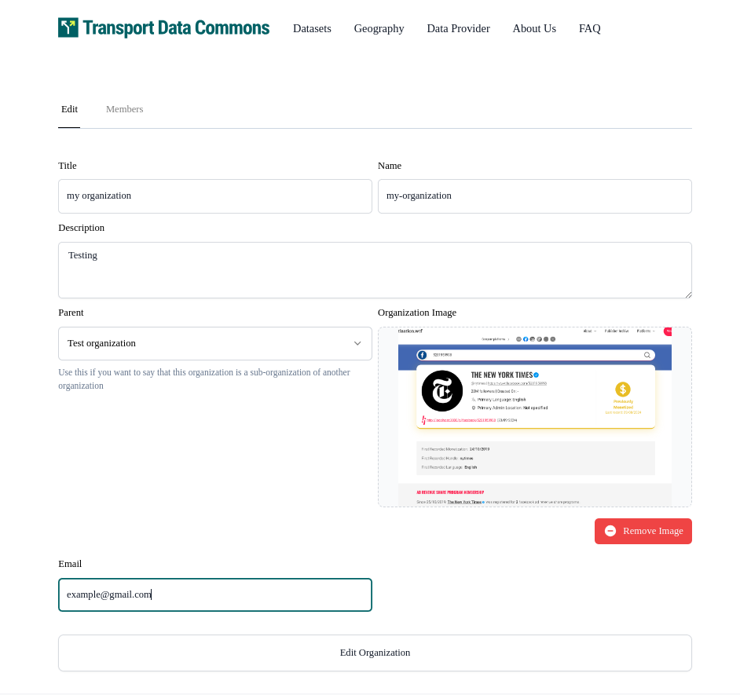
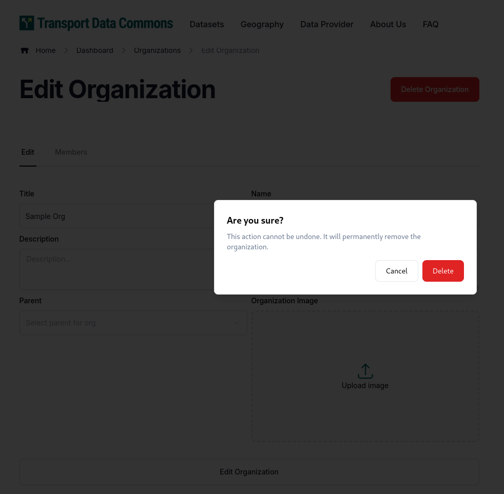
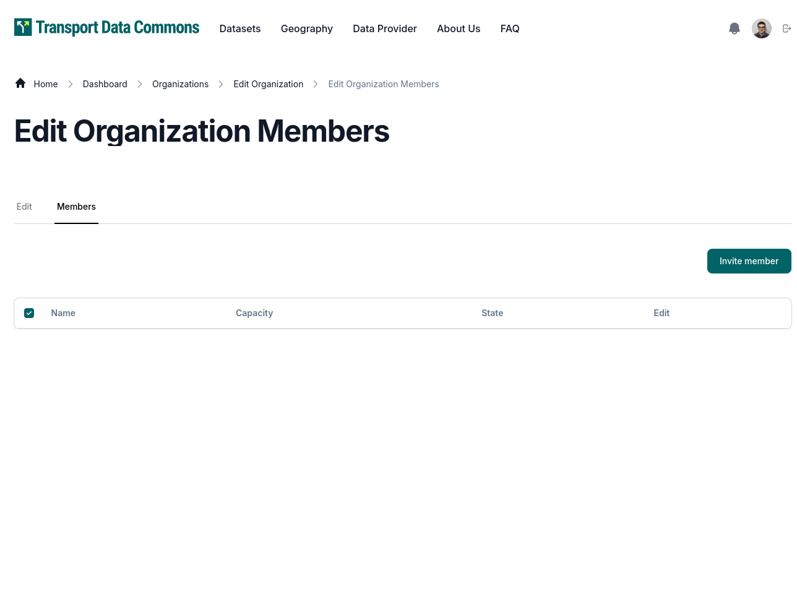
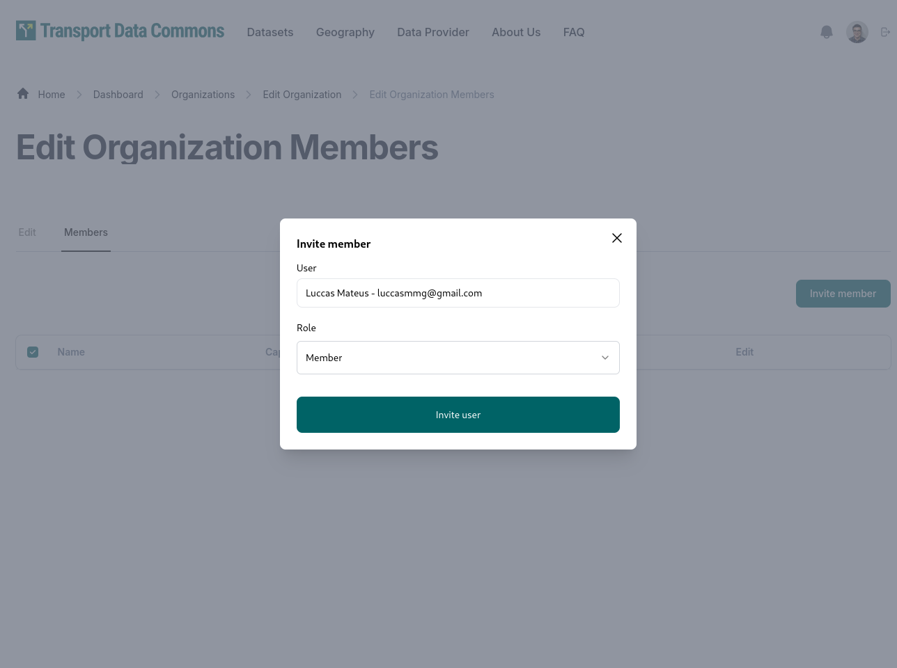
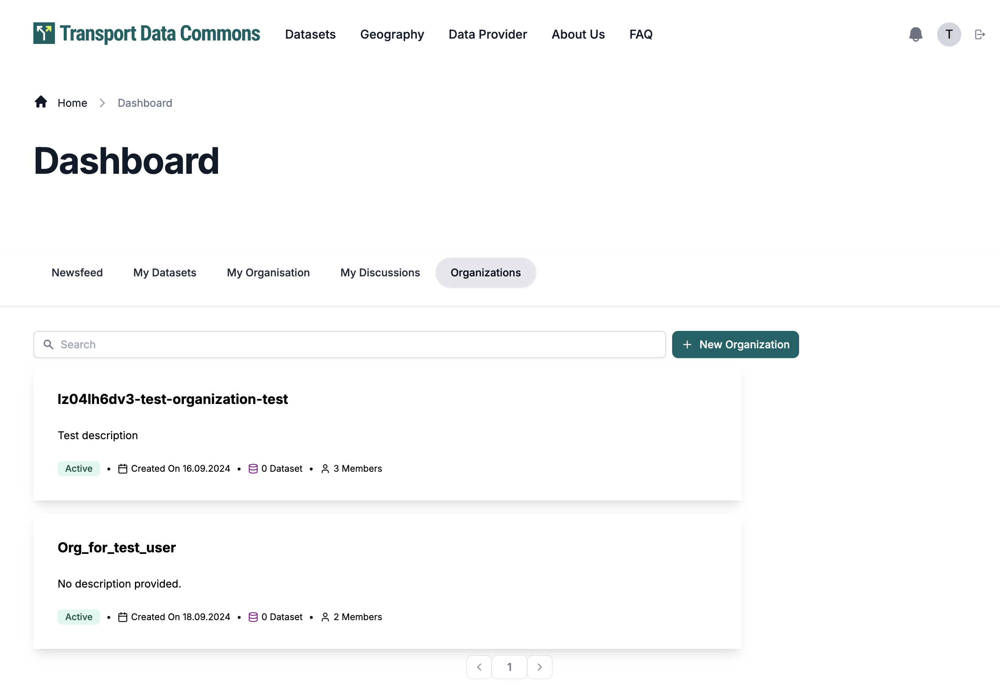
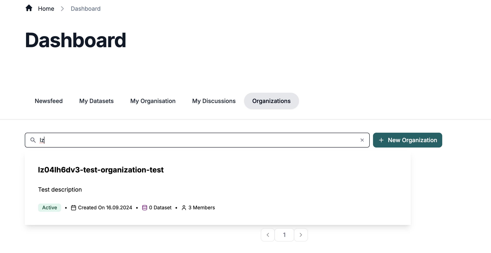

# ORGANIZATIONS

## Create Organization

You can create a organization in the `/dashboard/organizations/create` route where you can define. Only sysadmin user can create an organization.

- Title for the organization
- URL for the organization, which is going to act as an ID for the organization, and act as URL in the public pages such `/organizations/{organization url}`
- Description for the organization
- You can also upload an image to act as a logo or featured image for the organization
- You can also define a parent for the organization, which is going to be another organization and is going to decide the place of that organization inside the hierarchy

The page looks like this

## Edit Organization

You can edit a organization by going to `/dashboard/organizations/{organization url}/edit`

In this edit page, you can also delete by clicking on the "Delete Button" which should open up a modal for confirmation

## Organization Member Management

You can edit an organization members in the `/dashboard/organizations/{organization url}/members` or by clicking on 'Members' in the edit page

To add a new member, simply click on "Add another member", select the user and their capacity, and then click "Save" (you can also edit any existing members, or remove them by clicking on the small red `-` button on the right)

## List and Search Organizations
To view the Organizations list, you can go to `/dashboard/organizations`.
Sysadmin users can view all organizations.
Other users can view organizations in which they are `admin' level role.

You can search for Organizations based on their name, title and description.

Clicking on an organization will redirect you to Edit Organization Page.

