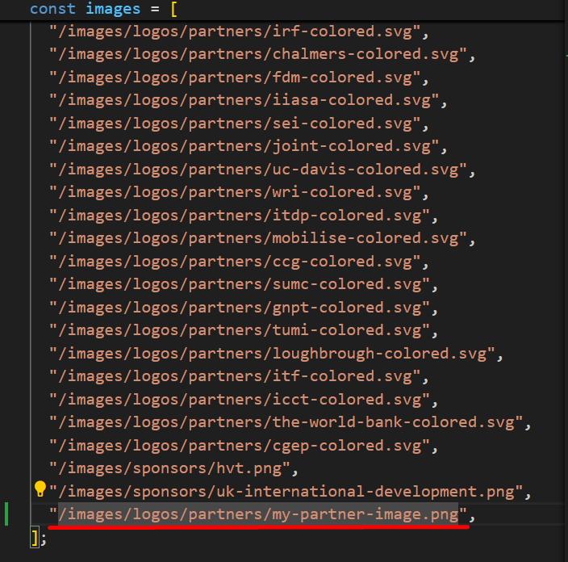

<!-- START doctoc generated TOC please keep comment here to allow auto update -->
<!-- DON'T EDIT THIS SECTION, INSTEAD RE-RUN doctoc TO UPDATE -->
**Table of Contents**  *generated with [DocToc](https://github.com/thlorenz/doctoc)*

- [Partners Carousel Component](#partners-carousel-component)
    - [Managing the Partners Images](#managing-the-partners-images)

<!-- END doctoc generated TOC please keep comment here to allow auto update -->

# Partners Carousel Component

### Managing the Partners Images

To manage the images presented on the carousel you need to add an image on the [partners folder](../../frontend/public/images/logos/partners) then add the name of the file on the list of the images presented on the carousel [here](https://github.com/transport-data/portal/blob/main/frontend/src/components/_shared/PartnersCarousel.tsx#L36).

