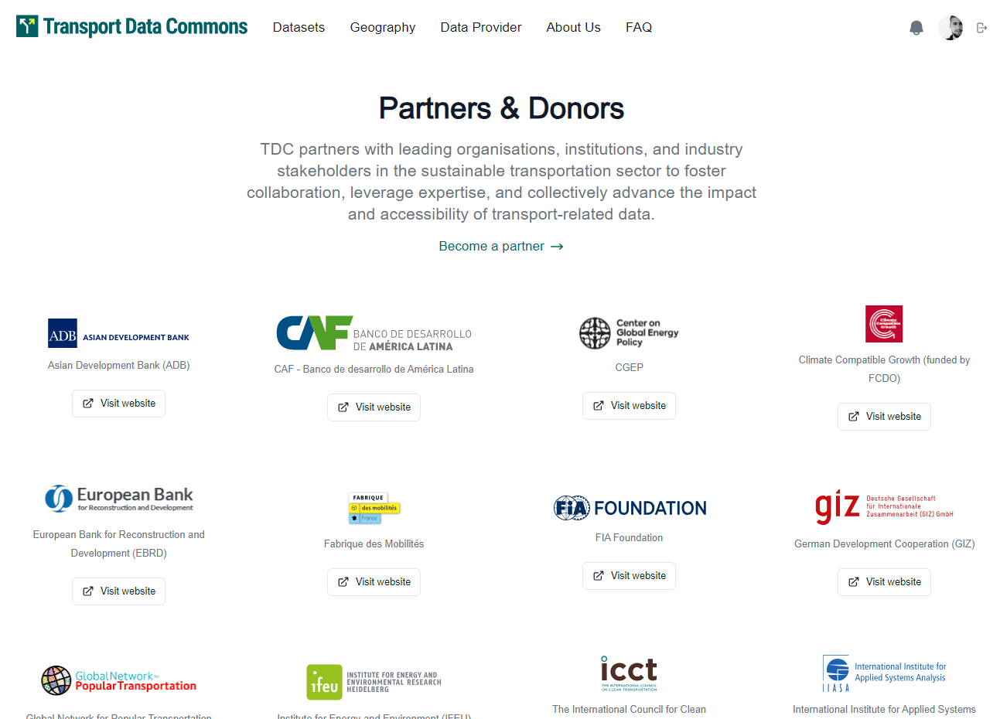

# Partners and Donors Page



To create/edit a partner or donor on the list

- open file `/frontend/data/partners.json`
- create/edit an item with following strucure:

  ```
    {
        "image": "/path/to/partner image",
        "name": "Name of the Partner",
        "url": "Partner website url"
    }
  ```

  **image**: can be a external url or, relative link which you'll need to store the image in the `/frontend/public` folder
