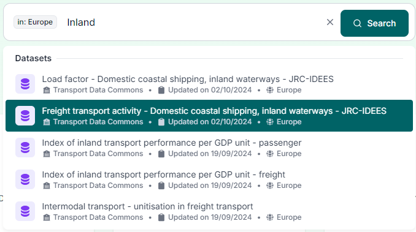
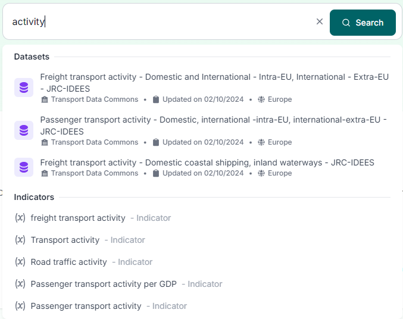

<!-- START doctoc generated TOC please keep comment here to allow auto update -->
<!-- DON'T EDIT THIS SECTION, INSTEAD RE-RUN doctoc TO UPDATE -->

- [Searchbar Component](#searchbar-component)
    - [How it works](#how-it-works)
  - [Available Filters](#available-filters)
    - [How to edit filters description](#how-to-edit-filters-description)
  - [Example of search with applied filter](#example-of-search-with-applied-filter)
  - [Search without applying filters](#search-without-applying-filters)
  - [Recent Searches](#recent-searches)

<!-- END doctoc generated TOC please keep comment here to allow auto update -->

# Searchbar Component

This component allows for a quick search of datasets and indicators, with the ability to filter by predefined fields.


By default, only 4 filter options are displayed. By clicking "Show all," more options become available for search.

### How it works

As the user types, the API returns Datasets or Indicators that contain the entered words in their title or description.
If a filter is applied to the search bar, the results will be limited to the selected filter.
By default, the API returns 5 results for Datasets and Indicators, ordered by relevance, with the user needing to type more specific words for more precise results.
Pressing `Enter` or clicking the search button will redirect the user to the `/search` page with the filters and typed text as parameters.

## Available Filters


**In:** Filter datasets by regions

- metadata field: **regions**

**After:** Filter datasets after a given year

- metadata field: **temporal_coverage_start**

**Before:** Filter datasets before a given year

- metadata field: **temporal_coverage_end**

**Sector:** Filter datasets by sectors

- metadata field: **sectors**

**Mode:** Filter datasets by mode

- metadata field: **modes**

**Service:** Filter datasets by service type

- metadata field: **services**

### How to edit filters description

Go to `/frontend/data/searchbar.config.json` and edit filter **description** as wanted.

**it is important not to change the object keys name (regions, startYear, endYear, sectors, modes, services)**

```json
{
  "regions": {
    "name": "in",
    "description": "filter for regions"
  },
  "startYear": {
    "name": "after",
    "description": "referencing data after a selected year"
  },
  "endYear": {
    "name": "before",
    "description": "referencing data before a selected year"
  },
  "sectors": {
    "name": "sector",
    "description": "road, rail, aviation, water transportation"
  },
  "modes": {
    "name": "mode",
    "description": "cars, cycling, heavy rail"
  },
  "services": {
    "name": "service",
    "description": "passenger or freight"
  }
}
```

**name**: filter name

**description**: filter description

## Example of search with applied filter

This example demonstrates a search by region.

1. Select the desired filter  
   
2. Select the desired region  
   
3. Search for keywords  
   

## Search without applying filters

Applying a filter is not mandatory, and users are free to search for datasets using only the search bar.



## Recent Searches

Whenever a user performs a search (by pressing `Enter` or clicking the **Search** button) or selects an indicator, that search is saved in localStorage (in the user's browser) and presented as follows:


The component stores the last 5 searches.
