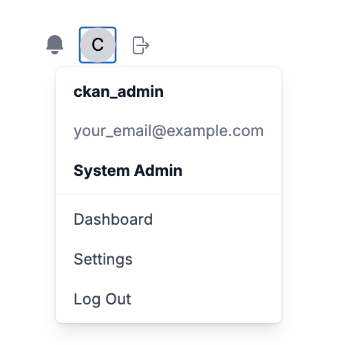
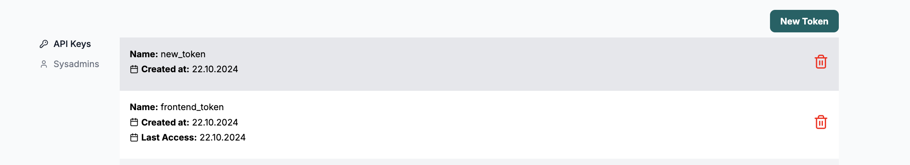
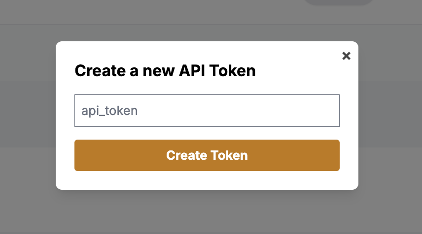
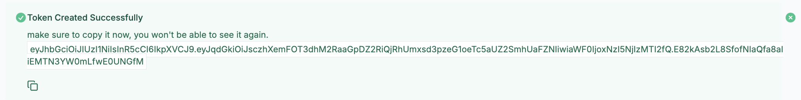
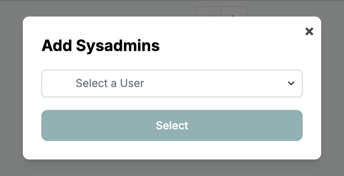

# Settings

Once the user logs in, he can access the settings tab at `dashboard/settings` route.
User can also access the page by clicking on the settings option on the user profile dropdown.

The Settings page has two Tabs

## API Keys

On this tab, users can manage their api keys. Users can view, revoke and add new api keys.

### Revoking API Key

Users can revoke api keys by clicking on the delete icon.

### Add New API Key

Users can add new API keys by clicking on the `New Token` button. A popup will appear where user can enter the name of the key.

Make sure to copy the key once it is created

## Sysadmins

This tab is only visible to sysadmin users. On this tab, sysadmin users can manage other sysadmin users.
They can promote users to sysadmin or demote users from sysadmin.

### Promote User To Sysadmin

Users can click on the `New Sysadmin` button to promote other non-sysadmin users.

### Demote Users

User can demote individual users by clicking on the `Remove` button or select multiple users
