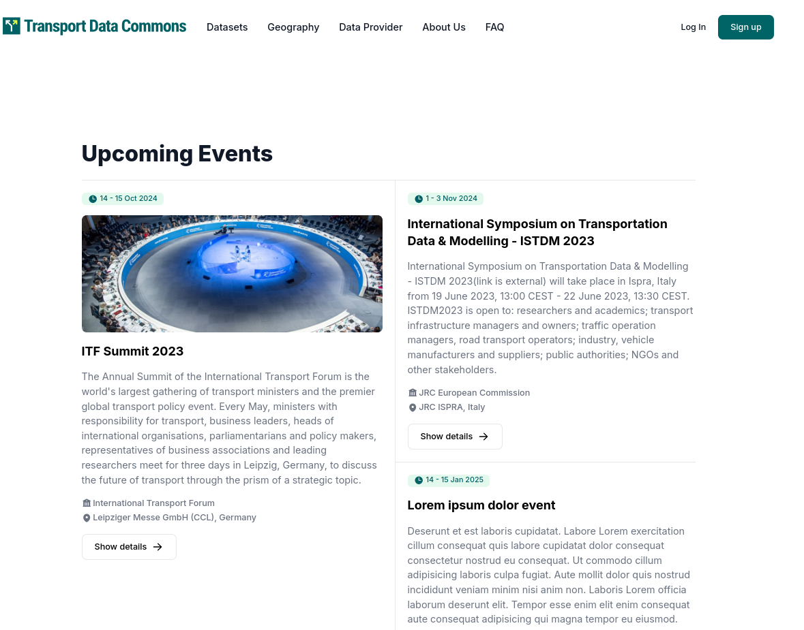
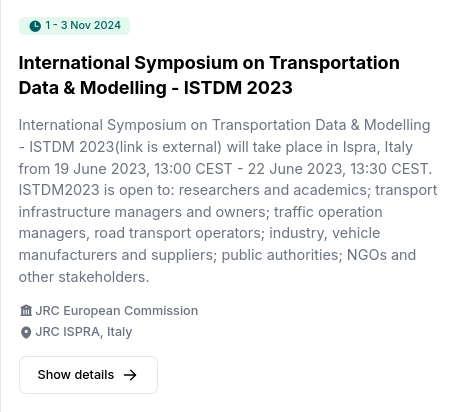

# Events page

If you want to change the content in the Events Page



All you need to do is add or edit the files in the `frontend/md/faq` folder

We currently have the following structure

```
.
├── ISTDM.md
├── ITF Summit 2023.md
└── Lorem ipsum dolor.md
```

Inside each of these files there is the following content, for example


```
---
title: International Symposium on Transportation Data & Modelling - ISTDM 2023
image: /images/events/istdm-2023.png
from: 2024-11-02
to: 2024-11-04
organization: JRC European Commission
location: JRC ISPRA, Italy
---

[International Symposium on Transportation Data & Modelling - ISTDM 2023(link is external)](https://joint-research-centre.ec.europa.eu/events/istdm2023-2023-06-19_en) will take place in Ispra, Italy from 19 June 2023, 13:00 CEST - 22 June 2023, 13:30 CEST.

ISTDM2023 is open to: researchers and academics; transport infrastructure managers and owners; traffic operation managers, road transport operators; industry, vehicle manufacturers and suppliers; public authorities; NGOs and other stakeholders.
```

As you can see we have:

- A title, which is going to be the title of the event. 
- An image, which can either be a full fledged URL or a relative link, altough please note that if you do the relative link you need to store the image in the `/frontend/public` folder
- A from and to items that are going to define the date of the event, and need to be set in machine readable format, so YYYY-MM-17/09/2024
- The organization and the location, which are just some extra metadata that is added as badges

And in the end the markdown content, that can contain any number of item such as headings, links, lists etc

So with the following information we can see that the example gave above is going to end up like this in the page




