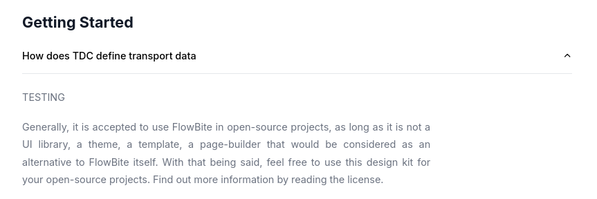

# FAQ Page

If you want to change the content in the FAQ Page


All you need to do is add or edit the files in the `frontend/md/faq` folder

We currently have the following structure

```
.
├── intro.md
├── question1.md
├── question2.md
├── question3.md
├── question4.md
├── question5.md
├── question6.md
└── question7.md

```

Inside each of these files there is the following content, for example


```
---
title: How does TDC define transport data
category: getting_started
---

Generally, it is accepted to use FlowBite in open-source projects, as long as it is not a UI library, a theme, a template, a page-builder that would be considered as an alternative to FlowBite itself.
With that being said, feel free to use this design kit for your open-source projects.
Find out more information by reading the license.
```

As you can see we have a title, that is going to me mapped to the tile of the question, markdown content in the end and a `category` item, 
this category item is used to define where in the page that question is going to live, we currently have the following categories

- getting_started = Getting Started
- organizations = Organizations
- submitting_data = Submitting Data
- sharing_data = Sharing and Using Data
- geodata = Geodata
- search = Search
- metadata = Metadata and Data Quality
- devs = Resources for Developers
- sensitive_data = Sensitive Data
- licenses = Data Licenses

We also have a special category called `intro` that is used to define the content in the initial text of the FAQ Page

So with the following information we can see that the example gave above is going to end up like this in the page



In the 'Getting started' section

One final thing to none is that the questions are arranged in alphabetical order of the filename, so inside the category `question1.md` is going to come before `question2.md` etc
