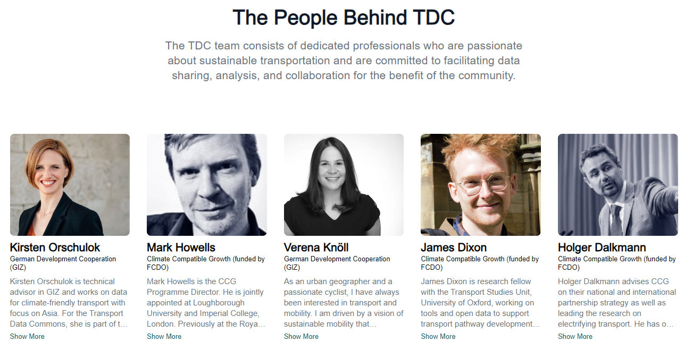

<!-- START doctoc generated TOC please keep comment here to allow auto update -->
<!-- DON'T EDIT THIS SECTION, INSTEAD RE-RUN doctoc TO UPDATE -->
**Table of Contents**  *generated with [DocToc](https://github.com/thlorenz/doctoc)*

- [People Behind TDC](#people-behind-tdc)

<!-- END doctoc generated TOC please keep comment here to allow auto update -->

# People Behind TDC

To manage the "People Behind TDC" content:



Simply add or edit files in the `frontend/md/people` folder.

**Folder structure:**

```
.
├── name-of-person-1.md
├── name-of-person-2.md
└── name-of-person-3.md
...
```

Each file contains content structured as follows. For example:

```
---
title: Verena Knöll
image: /images/people/verena-knoll.png
info: German Development Cooperation (GIZ)
---

As an urban geographer and a passionate cyclist, I have always been interested in transport and mobility. I am driven by a vision of sustainable mobility that enhances both the quality of human life and of the natural environment.
Having lived in different cities around the world, I highly value international exchange and cooperation. I am convinced that global challenges require cooperative solutions. I am thus glad to support the TraCS project team in aligning transport and climate action plans in emerging economies and developing countries.
```

The key components in each file are:

- **title**: The person's name.
- **image**: The person's image, which can be either a full URL or a relative link. If using a relative link, the image must be stored in the `/frontend/public` folder.
- **info**: The organization the person belongs to.

After these frontmatter sections, you can add the markdown content describing the person's bio, which may include headings, links, lists, and more.
