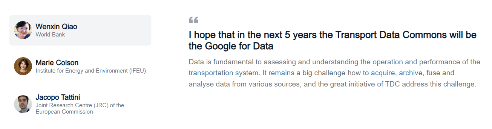

<!-- START doctoc generated TOC please keep comment here to allow auto update -->
<!-- DON'T EDIT THIS SECTION, INSTEAD RE-RUN doctoc TO UPDATE -->
**Table of Contents**  *generated with [DocToc](https://github.com/thlorenz/doctoc)*

- [Testimonials Section](#testimonials-section)
    - [Key fields:](#key-fields)

<!-- END doctoc generated TOC please keep comment here to allow auto update -->

# Testimonials Section

To update the content in the testimonials section on the home page:



Simply add or edit files in the `frontend/md/testimonials` folder. The current structure is as follows:

```
.
├── jacopo-tattini.md
├── marie-colson.md
└── wenxin-qiao.md
```

Inside each of these files there is the following content structure, for example

```
---
title: Improved data is essential to support better informed decisions and deliver improved transport systems and operations
name: Marie Colson
image: /images/people/marie-colson.png
organization: Institute for Energy and Environment (IFEU)
---

We are looking for years for a high quality database delivering transport data for Southern countries, we regularly work with. Data quality is hindering a lot our work on quantifying the impact of transport on climate change and local pollution levels. Finding solution starts with having quality data. We are therefore thrilled to be part of this incredible initiative.

```

### Key fields:

- **Title**: The title of the testimonial.
- **Name**: The name of the person giving the testimonial.
- **Image**: The person’s image, either as a full URL or a relative link. If using a relative link, store the image in the `/frontend/public` folder.
- **Organization**: The organization the person is affiliated with.

Following these fields is the markdown content of the testimonial.
