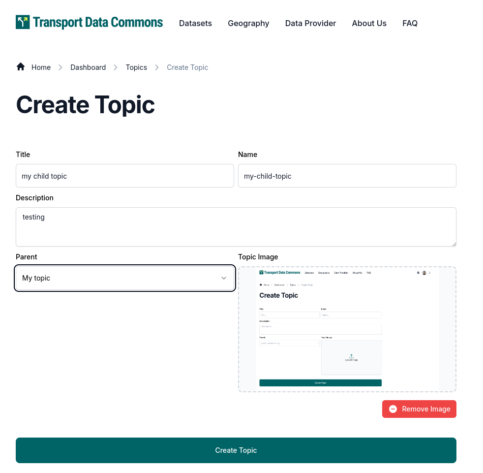
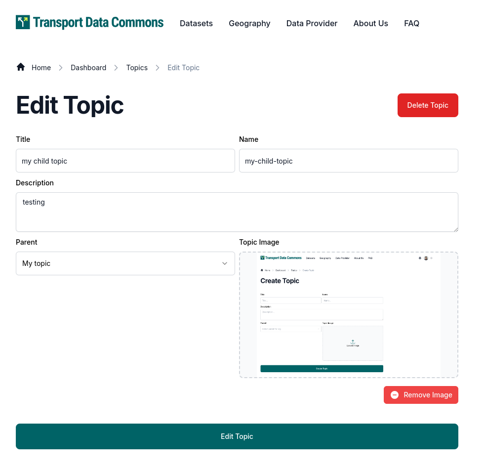
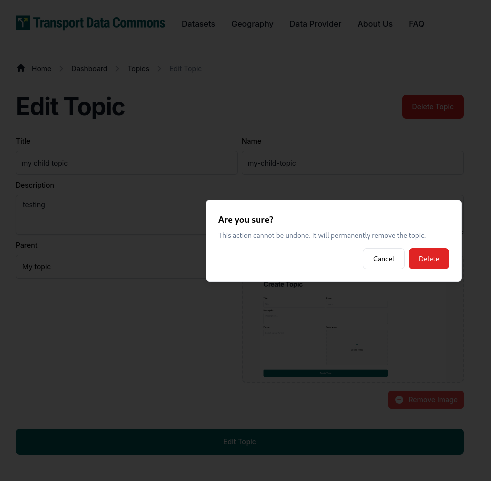
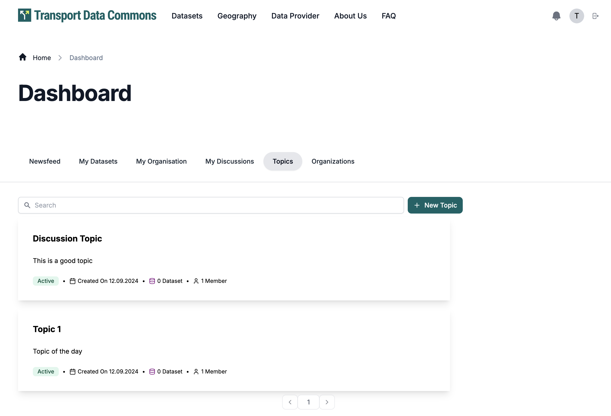
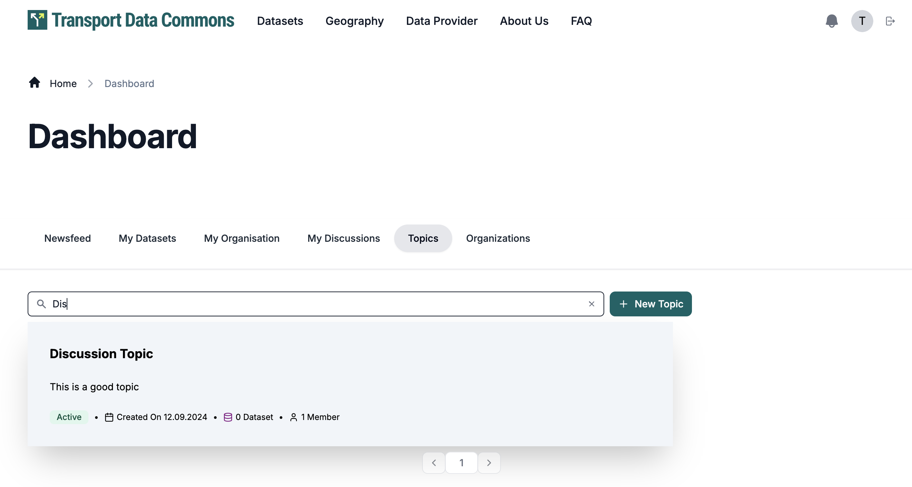

<!-- START doctoc generated TOC please keep comment here to allow auto update -->
<!-- DON'T EDIT THIS SECTION, INSTEAD RE-RUN doctoc TO UPDATE -->
**Table of Contents**  *generated with [DocToc](https://github.com/thlorenz/doctoc)*

- [TOPICS](#topics)
  - [Create Topic](#create-topic)
  - [Edit Topic](#edit-topic)
  - [List and Search Topics](#list-and-search-topics)
  - [Topics page](#topics-page)

<!-- END doctoc generated TOC please keep comment here to allow auto update -->

# TOPICS

## Create Topic

You can create a topic in the `/dashboard/topics/create` route where you can define

- Title for the topic
- URL for the topic, which is going to act as an ID for the topic, and act as URL in the public pages such `/topics/{topic url}`
- Description for the topic
- You can also upload an image to act as a logo or featured image for the topic
- You can also define a parent for the topic, which is going to be another topic and is going to decide the place of that topic inside the hierarchy

The page looks like this

## Edit Topic

You can edit a topic by going to `/dashboard/topics/{topic url}/edit`

In this edit page, you can also delete by clicking on the "Delete Button" which should open up a modal for confirmation

## List and Search Topics
To view the Topics list, you can go to `/dashboard/topics`.
Only Sysadmin users can view and Search topics.

You can search for Topics based on their name, title and description.

Clicking on a Topics will redirect you to Edit Topic Page.

## Topics page

If you go to the `/datasets` page you will see a grid with all the topics and 5 sample datasets, besides that you will also have a list of datasets which are TDC Harmonized and the most popular datasets with data retrieved from Google Analytics

